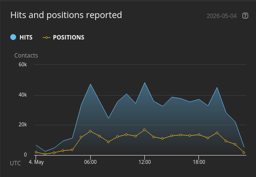
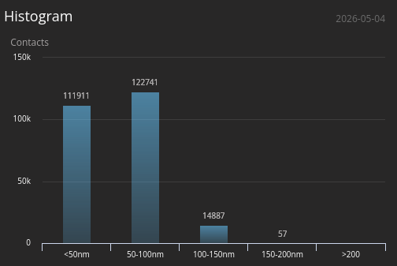
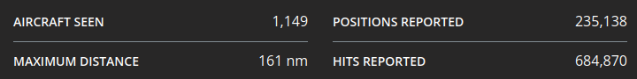

Following our work on maritime AIS, we are now targeting aviation. This guide explains how to build a professional-grade ADS-B station on a Raspberry Pi 3. We are using **Buildroot** to create a custom Linux firmware that is ultra-lightweight, boots in seconds, and runs entirely in RAM (read-only) to prevent SD card corruption.

* * *

### 1. Project Architecture

We use the `BR2_EXTERNAL` mechanism to keep our custom logic clean and portable. First, clone the stable Buildroot source:

```bash
git clone https://gitlab.com/buildroot.org/buildroot.git
cd buildroot
git checkout 2025.02.13
```

Our project tree is organized as follows:

```text
.
├── buildroot/             # Official sources (git clone)
├── external-pi/           # Custom recipes layer
│   ├── Config.in
│   ├── external.desc
│   ├── external.mk
│   ├── board/             # <--- Boot configs (config.txt, cmdline.txt)
│   └── package/
│       ├── librtlsdr-blog/
│       ├── mlat-client/
│       └── readsb/
└── overlay/               # System files (Init, Network, Configs)
    ├── etc/
    │   ├── fr24feed.ini
    │   ├── init.d/
    │   │   ├── S50readsb
    │   │   ├── S60fr24
    │   │   ├── S99mlat-client-adsbfi
    │   │   └── S99mlat-client-adsbx
    │   ├── lighttpd/
    │   ├── modprobe.d/
    │   ├── network/
    │   └── wpa_supplicant.conf
    ├── usr/bin/fr24feed
    └── var/www/tar1090
```

* * *

### 2. The External Layer (external-pi)

These files declare the project to Buildroot:

**external-pi/external.desc**:
```text
name: PI_FEEDER_EXT
desc: Station ADS-B pour Pi3
```

**external-pi/external.mk**:
```makefile
include $(sort $(wildcard $(BR2_EXTERNAL_PI_FEEDER_EXT_PATH)/package/*/*.mk))
```

**external-pi/Config.in** (Menu integration):
```text
source "$BR2_EXTERNAL_PI_FEEDER_EXT_PATH/package/librtlsdr-blog/Config.in"
source "$BR2_EXTERNAL_PI_FEEDER_EXT_PATH/package/readsb/Config.in"
source "$BR2_EXTERNAL_PI_FEEDER_EXT_PATH/package/mlat-client/Config.in"
```

* * *

### 3. Software Recipes & Compilation

#### A. Optimized Drivers: librtlsdr-blog

**external-pi/package/librtlsdr-blog/Config.in**:
```text
config BR2_PACKAGE_LIBRTLSDR_BLOG
	bool "librtlsdr-blog"
	select BR2_PACKAGE_LIBUSB
	help
	  Version optimisée pour RTL-SDR Blog V4 avec support Bias-T.

	  https://github.com/rtlsdrblog/rtl-sdr-blog
```

**external-pi/package/librtlsdr-blog/librtlsdr-blog.mk**:
```makefile
LIBRTLSDR_BLOG_VERSION = master
LIBRTLSDR_BLOG_SITE = $(call github,rtlsdrblog,rtl-sdr-blog,$(LIBRTLSDR_BLOG_VERSION))
LIBRTLSDR_BLOG_LICENSE = GPL-2.0+
LIBRTLSDR_BLOG_INSTALL_STAGING = YES

LIBRTLSDR_BLOG_DEPENDENCIES = libusb

# On active explicitement le détachement du driver kernel (DVB-T) 
# et l'installation des outils (rtl_sdr, rtl_biast, etc.)
LIBRTLSDR_BLOG_CONF_OPTS = \
	-DINSTALL_UDEV_RULES=ON \
	-DDETACH_KERNEL_DRIVER=ON

$(eval $(cmake-package))
```

#### B. The Decoder: readsb

**external-pi/package/readsb/Config.in**:
```text
config BR2_PACKAGE_READSB
	bool "readsb"
	select BR2_PACKAGE_LIBRTLSDR_BLOG
	select BR2_PACKAGE_NCURSES
	select BR2_PACKAGE_ZLIB
	select BR2_PACKAGE_ZSTD
	help
	  Readsb est un décodeur ADS-B haute performance.
```

**external-pi/package/readsb/readsb.mk**:
```makefile
READSB_VERSION = master
READSB_SITE = $(call github,wiedehopf,readsb,$(READSB_VERSION))
READSB_DEPENDENCIES = librtlsdr-blog ncurses zlib zstd
READSB_LICENSE = GPL-3.0

# On utilise le hook SED pour les versions
define READSB_FIX_VERSION_MACROS
	sed -i 's/READSB_SHORT_VERSION/"2025"/g' $(@D)/json_out.c
	sed -i 's/READSB_SHORT_COMMIT/"v4"/g' $(@D)/json_out.c
endef
READSB_POST_PATCH_HOOKS += READSB_FIX_VERSION_MACROS

# On passe RTLSDR=yes ET on force le flag de compilation manuellement dans CFLAGS
READSB_MAKE_OPTS = \
	RTLSDR=yes \
	CFLAGS="$(TARGET_CFLAGS) -D_GNU_SOURCE -D_DEFAULT_SOURCE -DENABLE_RTLSDR"

define READSB_BUILD_CMDS
	$(TARGET_MAKE_ENV) $(MAKE) $(TARGET_CONFIGURE_OPTS) -C $(@D) $(READSB_MAKE_OPTS)
endef

define READSB_INSTALL_TARGET_CMDS
	$(INSTALL) -D -m 0755 $(@D)/readsb $(TARGET_DIR)/usr/bin/readsb
	$(INSTALL) -D -m 0755 $(@D)/viewadsb $(TARGET_DIR)/usr/bin/viewadsb
endef

$(eval $(generic-package))
```

#### C. MLAT Client

**external-pi/package/mlat-client/Config.in**:
```text
config BR2_PACKAGE_MLAT_CLIENT
	bool "mlat-client"
	depends on BR2_PACKAGE_PYTHON3
	select BR2_PACKAGE_PYTHON_PYASYNCORE
	select BR2_PACKAGE_PYTHON_PYASYNCHAT²
	select BR2_PACKAGE_PYTHON3_ZLIB
	help
	  Mode S Multilateration client for ADS-B feeders.

	  https://github.com/mutability/mlat-client

comment "mlat-client needs python3"
	depends on !BR2_PACKAGE_PYTHON3
```

**external-pi/package/mlat-client/mlat-client.mk**:
```makefile
MLAT_CLIENT_VERSION = 0.2.13
MLAT_CLIENT_SITE = $(call github,mutability,mlat-client,v$(MLAT_CLIENT_VERSION))
MLAT_CLIENT_LICENSE = GPL-3.0
MLAT_CLIENT_LICENSE_FILES = COPYING
MLAT_CLIENT_SETUP_TYPE = setuptools

$(eval $(python-package))
```

* * *

### 4. System Configuration (Overlay)

The overlay directory contains custom configuration files and pre-compiled binaries that are merged into the final root filesystem.

> **Note:** Some binaries like `fr24feed` and the `tar1090` web interface files should be placed manually in the `overlay/` directory before building if they are not managed by a Buildroot recipe.

#### Network & WiFi

**overlay/etc/network/interfaces**:
```text
auto lo
iface lo inet loopback

auto eth0
iface eth0 inet dhcp

auto wlan0
iface wlan0 inet dhcp
    pre-up sleep 2
    wpa-conf /etc/wpa_supplicant.conf
```

**overlay/etc/wpa_supplicant.conf**:
```text
country=FR
network={
    ssid="YOUR_SSID"
    psk="YOUR_PASSWORD"
}
```

**overlay/etc/modprobe.d/rtlsdr-blacklist.conf**:
```text
blacklist dvb_usb_rtl28xxu
blacklist rtl2832
blacklist rtl2830
```

#### Init Scripts (The Automation)

**overlay/etc/init.d/S50readsb** (The Core Decoder):
```bash
#!/bin/sh

DAEMON="readsb"
BINARY="/usr/bin/readsb"
SITE_UUID="YOUR_UUID"

# Arguments finaux
ARGS="--device-type rtlsdr \
      --net \
      --fix \
      --dcfilter \
      --lat YOUR_LAT \
      --lon YOUR_LON \
      --net-ri-port 0 \
      --net-ro-port 30002 \
      --net-bi-port 30004 \
      --net-bo-port 30005 \
      --write-json /tmp/readsb \
      --net-connector feed.adsb.fi,30004,beast_reduce_out,uuid=$SITE_UUID \
      --net-connector feed.adsbexchange.com,30004,beast_reduce_out"

case "$1" in
    start)
        echo -n "Starting $DAEMON: "
        /usr/bin/rtl_biast -b 1 > /dev/null 2>&1
        sleep 1
        start-stop-daemon -S -b -x $BINARY -- $ARGS
        [ $? -eq 0 ] && echo "OK" || echo "FAIL"
        ;;
    stop)
        echo -n "Stopping $DAEMON: "
        start-stop-daemon -K -x $BINARY
        [ $? -eq 0 ] && echo "OK" || echo "FAIL"
        ;;
    restart)
        $0 stop
        sleep 1
        $0 start
        ;;
    *)
        echo "Usage: $0 {start|stop|restart}"
        exit 1
        ;;
esac
```

**overlay/etc/init.d/S99mlat-client-adsbx** (Feed ADSBExchange):
```bash
#!/bin/sh
NAME="mlat-client-adsbx"
DAEMON="/usr/bin/mlat-client"
PIDFILE="/var/run/$NAME.pid"

ARGS="--input-type dump1090 \
      --input-connect 127.0.0.1:30005 \
      --lat YOUR_LAT \
      --lon YOUR_LON \
      --alt 45m \
      --user YOUR_USER \
      --server feed.adsbexchange.com:31090 \
      --no-udp \
      --results beast,connect,127.0.0.1:30004"

case "$1" in
  start)
        echo -n "Starting $NAME: "
        start-stop-daemon -S -q -b -m -p $PIDFILE -x $DAEMON -- $ARGS
        echo "OK"
        ;;
  stop)
        echo -n "Stopping $NAME: "
        start-stop-daemon -K -q -p $PIDFILE
        echo "OK"
        rm -f $PIDFILE
        ;;
  restart)
        $0 stop
        sleep 1
        $0 start
        ;;
  *)
        echo "Usage: $0 {start|stop|restart}"
        exit 1
        ;;
esac
```

**overlay/etc/init.d/S99mlat-client-adsbfi** (Feed ADSB.fi):
```bash
#!/bin/sh
NAME="mlat-client-adsbfi"
DAEMON="/usr/bin/mlat-client"
PIDFILE="/var/run/$NAME.pid"

ARGS="--input-type dump1090 \
      --input-connect 127.0.0.1:30005 \
      --lat YOUR_LAT \
      --lon YOUR_LON \
      --alt 45m \
      --user YOUR_USER \
      --server feed.adsb.fi:31090 \
      --no-udp \
      --results beast,connect,127.0.0.1:30004"

case "$1" in
  start)
        echo -n "Starting $NAME: "
        start-stop-daemon -S -q -b -m -p $PIDFILE -x $DAEMON -- $ARGS
        echo "OK"
        ;;
  stop)
        echo -n "Stopping $NAME: "
        start-stop-daemon -K -q -p $PIDFILE
        echo "OK"
        rm -f $PIDFILE
        ;;
  restart)
        $0 stop
        sleep 1
        $0 start
        ;;
  *)
        echo "Usage: $0 {start|stop|restart}"
        exit 1
        ;;
esac
```

**overlay/etc/init.d/S60fr24** (FlightRadar24 Feed):
```bash
#!/bin/sh
DAEMON="fr24feed"
BINARY="/usr/bin/fr24feed"

case "$1" in
    start)
        echo -n "Starting $DAEMON: "
        sleep 2
        start-stop-daemon -S -b -x $BINARY
        [ $? -eq 0 ] && echo "OK" || echo "FAIL"
        ;;
    stop)
        echo -n "Stopping $DAEMON: "
        start-stop-daemon -K -x $BINARY
        [ $? -eq 0 ] && echo "OK" || echo "FAIL"
        ;;
    restart)
        $0 stop
        sleep 1
        $0 start
        ;;
    *)
        echo "Usage: $0 {start|stop|restart}"
        exit 1
        ;;
esac
```

#### Feeder Configurations

**overlay/etc/fr24feed.ini**:
```ini
receiver="beast-tcp"
fr24key="YOUR_FR24_KEY"
host="127.0.0.1:30005"
bs="no"
raw="no"
logmode="1"
logpath="/tmp"
mlat="yes"
mlat-without-gps="yes"
```

**overlay/etc/lighttpd/lighttpd.conf** (Web Interface):
```text
server.modules += ( "mod_alias", "mod_setenv" )
server.document-root        = "/var/www/tar1090"
server.port                 = 80
index-file.names            = ( "index.html" )

mimetype.assign = (
  ".html" => "text/html",
  ".css"  => "text/css",
  ".js"   => "application/javascript",
  ".json" => "application/json",
  ".png"  => "image/png",
  ".svg"  => "image/svg+xml"
)

alias.url += ( "/data/" => "/tmp/readsb/" )

$HTTP["url"] =~ "^/data/" {
    setenv.add-response-header = ( "Cache-Control" => "no-cache, no-store, must-revalidate" )
}
```

* * *

### 5. RAM-Only Boot Configuration

To run the OS entirely in RAM, we use the **initramfs** strategy. This loads the `rootfs.cpio.gz` into the Raspberry Pi's memory at boot time. You have two options to implement this:

#### Method A: Automated (Buildroot Integration)
This is the professional way. The files are generated correctly every time you run `make`.

1.  **Prepare your custom board files:**
    Create a folder `external-pi/board/` and create two files:
    
    **external-pi/board/config.txt**:
    ```text
    # RAM Boot Config
    initramfs rootfs.cpio.gz followkernel
    # Enable UART for console
    enable_uart=1
    ```
    
    **external-pi/board/cmdline.txt**:
    ```text
    console=serial0,115200 console=tty1 root=/dev/ram0 rw rootwait
    ```

2.  **Configure Buildroot (`make menuconfig`):**
    *   **Filesystem images**:
        - Enable `cpio the root file system`.
        - Compression: `gzip`.
    *   **Target packages** -> **Hardware handling**:
        - Select `rpi-firmware`.
        - Set `Configuration file` to `$(BR2_EXTERNAL_PI_FEEDER_EXT_PATH)/board/config.txt`.
    *   **System configuration**:
        - Set `Custom scripts to run after creating the images` to point to a script that copies your `cmdline.txt` to the output folder (or use the default RPi post-image script and point it to your custom file).

#### Method B: Manual (Quick Edit on SD Card)
If you don't want to touch Buildroot files, you can edit the files on the SD card after flashing.

1.  **Flash the SD card** as described in Section 7.
2.  **Mount the BOOT partition** on your PC.
3.  **Edit `config.txt`**: Add the line `initramfs rootfs.cpio.gz followkernel`.
4.  **Edit `cmdline.txt`**: Replace the content with `console=serial0,115200 console=tty1 root=/dev/ram0 rw rootwait`.

**Note:** The Buildroot files in `buildroot/board/raspberrypi/` are templates. You should **never edit them directly**; always use a custom board directory in your `external-pi` layer as shown in Method A.

* * *

### 6. Buildroot Setup Checklist

Enable these options in `make menuconfig` to match our project's requirements:

*   **Target options:** Cortex-A53, NEON-VFPV4, Hard float (EABIhf), instructions ARM (not Thumb2).
*   **Toolchain:** `Glibc` library, Linux Headers `6.6.x`, `GCC 13.x`, `Binutils 2.43.x`. Enable `Wchar`, `Locale`, and `C++` support.
*   **Kernel:** Custom Raspberry Pi kernel (`bcm2709_defconfig`) using the 6.6.y branch. Enable `Device Tree` support and `DTB overlay support`.
*   **System Configuration:**
    - `Root login` enabled (password: `root`).
    - `DHCP` enabled on `eth0`.
    - `BR2_ROOTFS_OVERLAY` pointing to your `overlay/` directory.
    - `Purge locale` (C, en_US).
*   **WiFi Stack:** `linux-firmware -> Broadcom BCM43xxx` & `Cypress CYW43xxx`.
*   **Networking:** `lighttpd` (with `zlib`), `dropbear` (SSH), `wpa_supplicant` (with `nl80211`), `chrony` (NTP sync).
*   **Tools:** `bash`, `python3` (with `zlib`, `unicodedata`, `pyasyncore`, `pyasynchat`), `socat`, `kmod` (tools), `ca-certificates`.
*   **Libraries:** `libusb`, `ncurses`, `readline`, `zlib`, `zstd`, `xxhash`.
*   **Filesystem:** `cpio` with `gzip` compression.

* * *

### 7. Deployment

#### Method A: Manual SD Formatting

```bash
# Format 1 FAT32 partition on SD card
sudo mkfs.vfat -F 32 -n BOOT /dev/sdX1
# Copy boot images from output/images/
sudo cp zImage rootfs.cpio.gz bcm2710-rpi-3-b.dtb rpi-firmware/* /mnt/sdcard/
```

#### Method B: Network Deployment (Fast Iteration)

```bash
# Update your running Pi remotely
scp -O output/images/zImage output/images/rootfs.cpio.gz \
       output/images/bcm2710-rpi-3-b.dtb root@192.168.1.123:/boot/
ssh root@192.168.1.123 "reboot"
```

* * *

### 8. Results & Performance

Once the station is up and running, you can access the local web interface (tar1090) to view real-time traffic. The custom Buildroot firmware ensures extremely low CPU usage and high stability.






