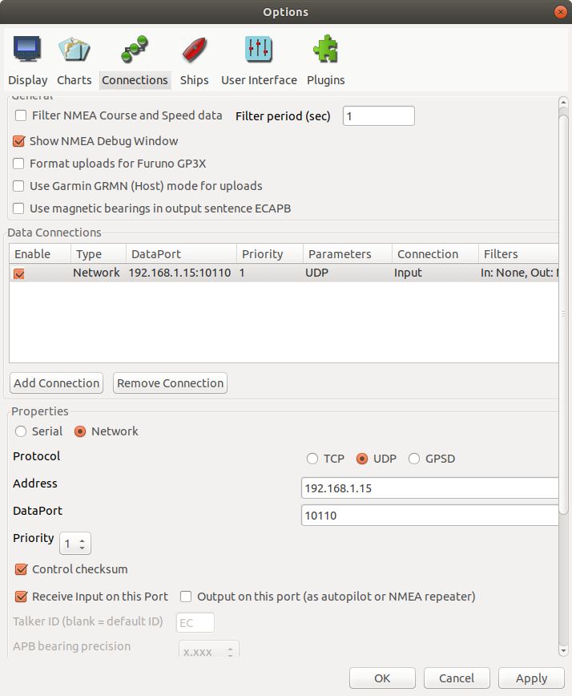
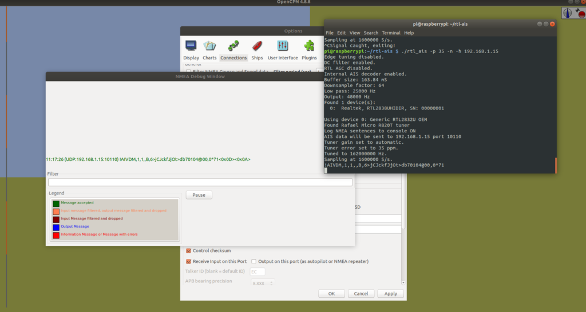
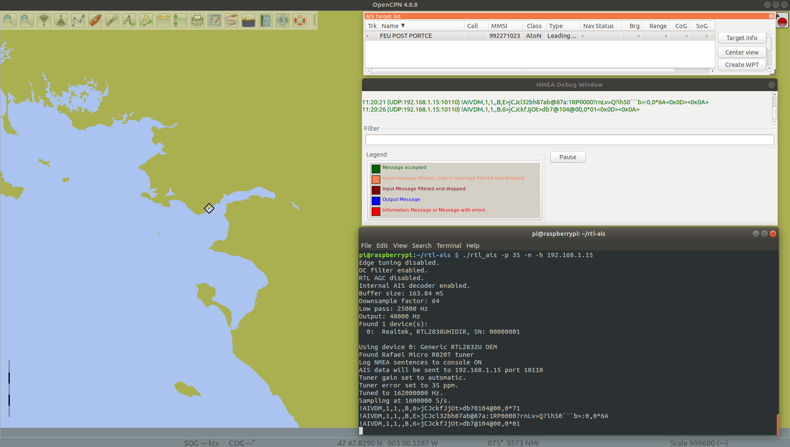

In order to get our AIS receiver on a Raspberry Pi with RTL-SDR, we'll install first the RTL-SDR software, then the AIS software.

## AIS Introduction

AIS stands for **Automatic Identification System**. It's a maritime navigation safety communication system used by ships and vessel traffic services (VTS) to track and identify ships in real-time. Here are some key details about AIS:

### Purpose:

- **Collision avoidance**: AIS helps vessels avoid collisions by providing real-time information about nearby ships.

- **Tracking and monitoring**: Authorities can track the location and movement of vessels, enhancing safety and maritime traffic management.

- **Navigation and situational awareness**: It assists with route planning and increases awareness of nearby ships, reducing accidents and improving operational efficiency.

### How it works:

AIS transmits data such as:

- **Ship’s position** (latitude, longitude)

- **Speed**

- **Course and heading**

- **Ship's name and identification** (e.g., IMO number)

- **Type of ship**

- **Destination and estimated time of arrival (ETA)**

AIS uses VHF radio frequencies (156.025 MHz to 162.025 MHz) to transmit this data to nearby ships and shore-based stations. There are two main types of AIS:

1. **AIS Class A**: Primarily for larger commercial vessels (required by international maritime regulations for ships over 300 GT).

3. **AIS Class B**: For smaller commercial or recreational vessels (typically transmitting less frequently than Class A).

### Components:

- **AIS Transponder**: A device installed on a vessel that sends and receives AIS signals.

- **AIS Base Stations**: Shore-based stations that receive signals from ships and can relay information to other vessels or maritime authorities.

- **AIS Receivers**: Devices that receive AIS signals for situational awareness (used by ships, authorities, and other entities).

## RTL-SDR software installation

Install required software for compilation :

```
sudo apt-get install git cmake libusb-1.0-0-dev build-essential
```

Clone software from Github :

```
git clone git://git.osmocom.org/rtl-sdr.git
```

Move to folder, compile, install and reboot :

```
cd  rtl-sdr
mkdir build
cd build
cmake ../ -DINSTALL_UDEV_RULES=ON
make
sudo make install
sudo ldconfig
cd ~
sudo cp ./rtl-sdr/rtl-sdr.rules /etc/udev/rules.d/
sudo reboot
```

Then we can test :

```
rtl_test 
```

You might have the following issue :

```
Found 1 device(s):
0: Realtek, RTL2838UHIDIR, SN: 00000001

Using device 0: Generic RTL2832U OEM

Kernel driver is active, or device is claimed by second instance of librtlsdr.
In the first case, please either detach or blacklist the kernel module
(dvb_usb_rtl28xxu), or enable automatic detaching at compile time.

usb_claim_interface error -6
Failed to open rtlsdr device #0.
```

Remove the problematic driver :

```
sudo modprobe -r dvb_usb_rtl28xxu
```

Blacklist it by creating the following file :

```
sudo vi /etc/modprobe.d/rtl-sdr-blacklist.conf
```

With the following content :

```
blacklist dvb_usb_rtl28xxu
```

Then we can test again :

```
rtl_test 
```

The output should looks like :

```
Found 1 device(s):
0: Realtek, RTL2838UHIDIR, SN: 00000001

Using device 0: Generic RTL2832U OEM
Found Rafael Micro R820T tuner
Supported gain values (29): 0.0 0.9 1.4 2.7 3.7 7.7 8.7 12.5 14.4 15.7 16.6 19.7 20.7 22.9 25.4 28.0 29.7 32.8 33.8 36.4 37.2 38.6 40.2 42.1 43.4 43.9 44.5 48.0 49.6
[R82XX] PLL not locked!
Sampling at 2048000 S/s.

Info: This tool will continuously read from the device, and report if
samples get lost. If you observe no further output, everything is fine.

Reading samples in async mode...
Allocating 15 zero-copy buffers
```

## RTL-SDR dongle calibration

Go back to your home folder :

```
cd ~
```

Install required software for compilation :

```
sudo apt install build-essential libtool automake autoconf librtlsdr-dev libfftw3-dev
```

Clone software from Github :

```
git clone https://github.com/steve-m/kalibrate-rtl
```

Move to folder, compile and install :

```
cd kalibrate-rtl/
./bootstrap && CXXFLAGS='-W -Wall -O3' 
./configure
make
sudo make install
```

Test it a few minutes to get a rough idea of the PPM deviation :

```
rtl_test -p
```

Output :

```
Found 1 device(s):
0: Realtek, RTL2838UHIDIR, SN: 00000001

Using device 0: Generic RTL2832U OEM
Found Rafael Micro R820T tuner
Supported gain values (29): 0.0 0.9 1.4 2.7 3.7 7.7 8.7 12.5 14.4 15.7 16.6 19.7 20.7 22.9 25.4 28.0 29.7 32.8 33.8 36.4 37.2 38.6 40.2 42.1 43.4 43.9 44.5 48.0 49.6
[R82XX] PLL not locked!
Sampling at 2048000 S/s.
Reporting PPM error measurement every 10 seconds...
Press ^C after a few minutes.
Reading samples in async mode...
lost at least 168 bytes
real sample rate: 2047684 current PPM: -154 cumulative PPM: -154
real sample rate: 2048101 current PPM: 50 cumulative PPM: -52
real sample rate: 2048077 current PPM: 38 cumulative PPM: -22
real sample rate: 2048198 current PPM: 97 cumulative PPM: 8
real sample rate: 2048066 current PPM: 33 cumulative PPM: 13
real sample rate: 2048093 current PPM: 46 cumulative PPM: 18
real sample rate: 2048072 current PPM: 36 cumulative PPM: 21
real sample rate: 2047986 current PPM: -6 cumulative PPM: 17
real sample rate: 2048079 current PPM: 39 cumulative PPM: 20
real sample rate: 2048108 current PPM: 53 cumulative PPM: 23
real sample rate: 2048037 current PPM: 18 cumulative PPM: 23
^CSignal caught, exiting!

User cancel, exiting...
Samples per million lost (minimum): 0
```

We’ll keep 23 as a rough PPM value at this stage.

Start to search for 900Mhz GSM stations :

```
kal -s 900 -g 49.6 -e 23
```

Output :

```
Found 1 device(s):
0: Generic RTL2832U OEM

Using device 0: Generic RTL2832U OEM
Found Rafael Micro R820T tuner
Exact sample rate is: 270833.002142 Hz
[R82XX] PLL not locked!
Setting gain: 49.6 dB
kal: Scanning for GSM-900 base stations.
GSM-900:
chan: 2 (935.4MHz - 16.587kHz) power: 869529.54
chan: 4 (935.8MHz + 38.960kHz) power: 2190452.67
chan: 5 (936.0MHz - 16.799kHz) power: 4623109.31
chan: 15 (938.0MHz + 38.865kHz) power: 815597.24
chan: 16 (938.2MHz - 15.502kHz) power: 2225985.25
chan: 20 (939.0MHz + 38.956kHz) power: 1047025.60
chan: 78 (950.6MHz - 12.733kHz) power: 3137623.08
chan: 123 (959.6MHz - 12.483kHz) power: 1856407.90
```

Then let’s find the PPM using here the channel 5 (as it is the stronger) :

```
kal -c 5 -g 49.6 -e 23
```

Output :

```
Found 1 device(s):
0: Generic RTL2832U OEM

Using device 0: Generic RTL2832U OEM
Found Rafael Micro R820T tuner
Exact sample rate is: 270833.002142 Hz
[R82XX] PLL not locked!
Setting gain: 49.6 dB
kal: Calculating clock frequency offset.
Using GSM-900 channel 5 (936.0MHz)
average [min, max] (range, stddev)
- 11.901kHz [-11934, -11871] (63, 18.615683)
overruns: 0
not found: 0
average absolute error: 35.715 ppm
```

Our average absolute error is 35.715 ppm !

## RTL-AIS Software

Go back to your home folder :

```
cd ~
```

Clone software from Github :

```
git clone https://github.com/dgiardini/rtl-ais
```

Move to folder, compile and install :

```
cd rtl-ais
make
```

Then we can run the software :

```
./rtl_ais -p 35 -n -h 192.168.1.15
```

\-p 35 : Software deviation in PPM found during the previous calibration. -n : Log AIS messages to console. -h : Send AIS data to the mentioned IP. Here, our desktop computer with OpenCPN.

Output :

```
Edge tuning disabled.
DC filter enabled.
RTL AGC disabled.
Internal AIS decoder enabled.
Buffer size: 163.84 mS
Downsample factor: 64
Low pass: 25000 Hz
Output: 48000 Hz
Found 1 device(s):
0: Realtek, RTL2838UHIDIR, SN: 00000001

Using device 0: Generic RTL2832U OEM
Found Rafael Micro R820T tuner
Log NMEA sentences to console ON
AIS data will be sent to 192.168.1.15 port 10110
Tuner gain set to automatic.
Tuner error set to 35 ppm.
Tuned to 162000000 Hz.
Sampling at 1600000 S/s.
!AIVDM,1,1,,B,6>jCJckfJjOt>db70104@00,0*71
!AIVDM,1,1,,B,E>jCJcl32bh87ab@87a:1RP0000?rnLv=Q?ih50```b>:0,0*6A
!AIVDM,1,1,,B,6>jCJckfJjOt>db7@104@00,0*01
!AIVDM,1,1,,A,6>jCJckfJjOt>db70104@00,0*72
!AIVDM,1,1,,B,E>jCJcl32bh87ab@87a:1RP0000?rnLn=Q?j@50```b>:0,0*59
!AIVDM,1,1,,B,6>jCJckfJjOt>db70104@00,0*71
!AIVDM,1,1,,A,6>jCJckfJjOt>db5P104@00,0*10
!AIVDM,1,1,,B,E>jCJcl32bh87ab@87a:1RP0000?rnM4=Q?ih50```b>:0,0*29
!AIVDM,1,1,,B,E>jCJcl32bh87ab@87a:1RP0000?rnLv=Q?gh50```b>:0,0*64
!AIVDM,1,1,,B,E>jCJcl32bh87ab@87a:1RP0000?rnLm=Q?k050```b>:0,0*2B
!AIVDM,1,1,,B,6>jCJckfJjOt>db70104@00,0*71
!AIVDM,1,1,,A,33IWVk0Ohvwma3BK1nlAIQ@L01vP,0*64
!AIVDM,1,1,,B,33IWVk0Ohrwma5vK1o2QRQFV00qh,0*27
!AIVDM,1,1,,A,13IWVk0Ohrwma74K1o;iS1Hd0L10,0*6E
!AIVDM,1,1,,B,33IWVk000bwmabjK1pdC8jBj01r0,0*33
!AIVDM,1,1,,B,E>jCJcl32bh87ab@87a:1RP0000?rnLk=Q?ih50```b>:0,0*77
!AIVDM,1,1,,A,13IWVk000IwmbLnK1qS8;h6d08<k,0*1A !AIVDM,1,1,,B,6>jCJckfJjOt>db6h104@00,0*28
!AIVDM,1,1,,B,33IWVk0Oh5wmbIJK1qALP@l:01o@,0*31
!AIVDM,1,1,,A,33IWVk0Oh7wmbI8K1qBdEPnB00pP,0*18
!AIVDM,1,1,,B,13IWVk0Oh6wmbHVK1qCdQhpJ087:,0*69
!AIVDM,1,1,,B,33IWVk0Oh7wmbHHK1qEdDPpT013@,0*36
!AIVDM,1,1,,A,13IWVk0Oh7wmbH0K1qFt00rd05C0,0*7E
!AIVDM,1,1,,A,33IWVk0Oh8wmbGJK1qHch0rr00ih,0*26
!AIVDM,1,1,,B,13IWVk1009wmbG:K1qJ;g0s005C0,0*11
!AIVDM,1,1,,A,13IWVk1008wmbFRK1qLKl@wB0<10,0*7A
!AIVDM,1,1,,B,13IWVk1Oh6wmbDPK1qTu0Q<H05C4,0*05 !AIVDM,1,1,,A,13IWVk1Oh5wmbDfK1qW=O1@d00Rp,0*67 !AIVDM,1,1,,A,6>jCJckfJjOt>db5P104@00,0*10
!AIVDM,1,1,,B,13IWVk1Oh4wmbCnK1qadqQE000R@,0*3A
!AIVDM,1,1,,A,13IWVk1Oh3wmbCrK1qcM0iGB08Gw,0*2A
!AIVDM,1,1,,B,13IWVk1Oh3wmbD6K1qeP@1KV05C4,0*0B
!AIVDM,1,1,,A,13IWVk1003wmbChK1qh=<AN40<0w,0*44 !AIVDM,1,1,,B,33IWVk1003wmbC@K1qje;QNH0I70,0*69 !AIVDM,1,1,,B,E>jCJcl32bh87ab@87a:1RP0000?rnLq=Q?gh50```b>:0,0*63
!AIVDM,1,1,,A,33IWVk1003wmbCFK1qlej1Rd0AfJ,0*48
!AIVDM,1,1,,A,13IWVk1003wmbCFK1qp@:1WB0000,0*5D
!AIVDM,1,1,,A,13IWVk1Oh1wmbCJK1qru21f40000,0*0C
!AIVDM,1,1,,B,33IWVk1001wmbBLK1qsnP1v80Dhr,0*27
!AIVDM,1,1,,A,33IWVk1000wmbCDK1qeoHAp20E<r,0*0A !AIVDM,1,1,,B,E>jCJcl32bh87ab@87a:1RP0000?rnLq=Q?j@50```b>:0,0*46
!AIVDM,1,1,,B,6>jCJckfJjOt>db70104@00,0*71
!AIVDM,1,1,,A,E>jCJcl32bh87ab@87a:1RP0000?rnLi=Q?j@50```b>:0,0*5D
!AIVDM,1,1,,A,6>jCJckfJjOt>db70104@00,0*72
!AIVDM,1,1,,B,6>jCJckfJjOt>db5h104@00,0*2B
```

This messages could be decoded online, for example here : [http://ais.tbsalling.dk/](http://ais.tbsalling.dk/)

## OpenCPN client

Here is my configuration:

- 192.168.1.12 : Raspberry Pi Zero with RTL-SDR dongle

- 192.168.1.15 : Laptop with Ubuntu desktop and OpenCPN software

Desktop OpenCPN configuration :



Using the debug window, we can check that AIS messages are well received by OpenCPN :

<figure>



<figcaption>

OpenCPN client check received messages

</figcaption>

</figure>

And AIS targets are shown on the map :

<figure>



<figcaption>

AIS targets on OpenCPN map

</figcaption>

</figure>

You're done : AIS receiver on a Raspberry Pi with RTL-SDR.

