For Siemens PLC simulation with virtual commissioning we'll use [PLCSIM Advanced](https://www.siemens.com/global/en/products/automation/systems/industrial/plc/s7-plcsim-advanced.html) and C# co-simulation.

## Configuration

We’ll run the simulator and the editor on two computers :

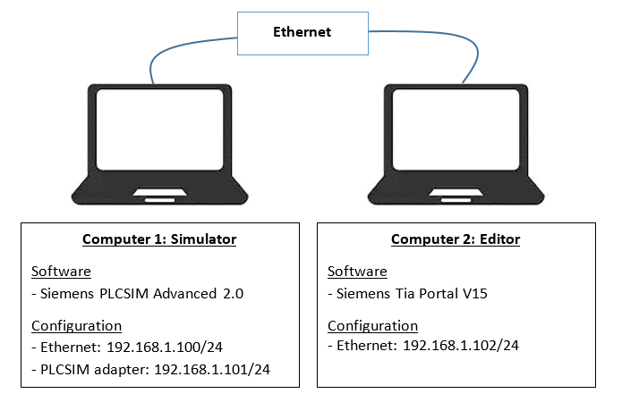

### Simulator configuration

First let’s start an instance with the following parameters :

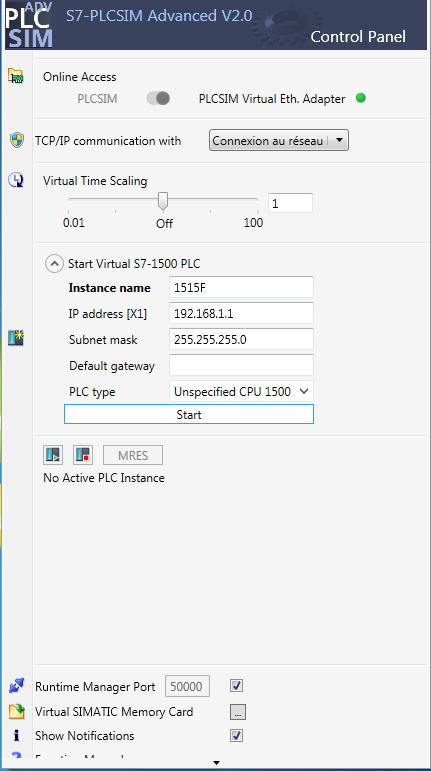

Once started, it should be like that :

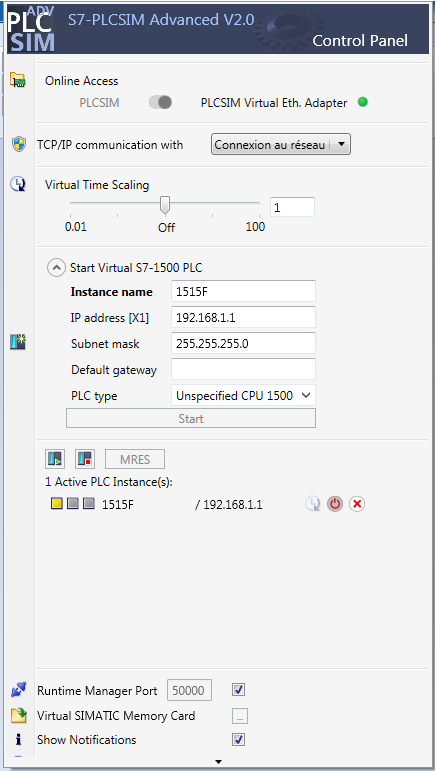

## PLC Programming

### Hardware configuration

Let’s do a simple configuration as follow :

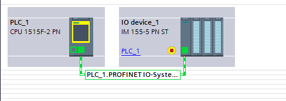

Network configuration :  
\- PLC\_1 : 192.168.1.1/24  
\- IO device\_1 : 192.168.1.2/24

Note : On the simulator, we have different IP addresses for all the network interfaces : Ethernet adapter, PLCSIM virtual ethernet adapter, PLC and I/Os !

With the following I/Os :

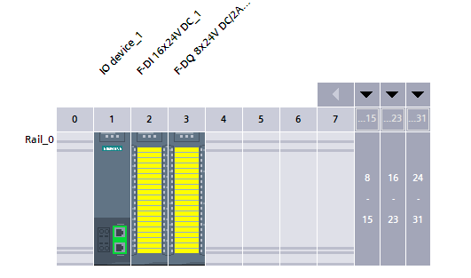

Note that you’ll need to activate this option in the project settings :

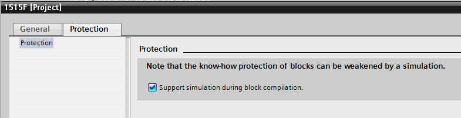

### Program

Our program will be very simple ! OB1 will toggle a bit every second :

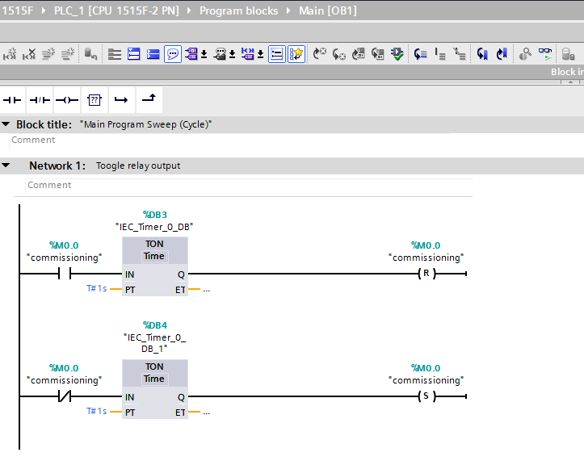

And FB1 will do a safety check between the relay output and the input feedback :

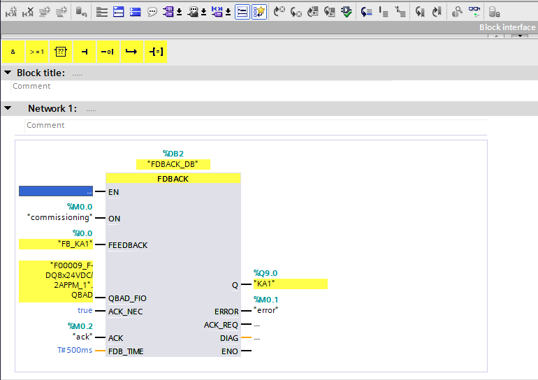

### Compiling and loading

You should be able to compile and load :

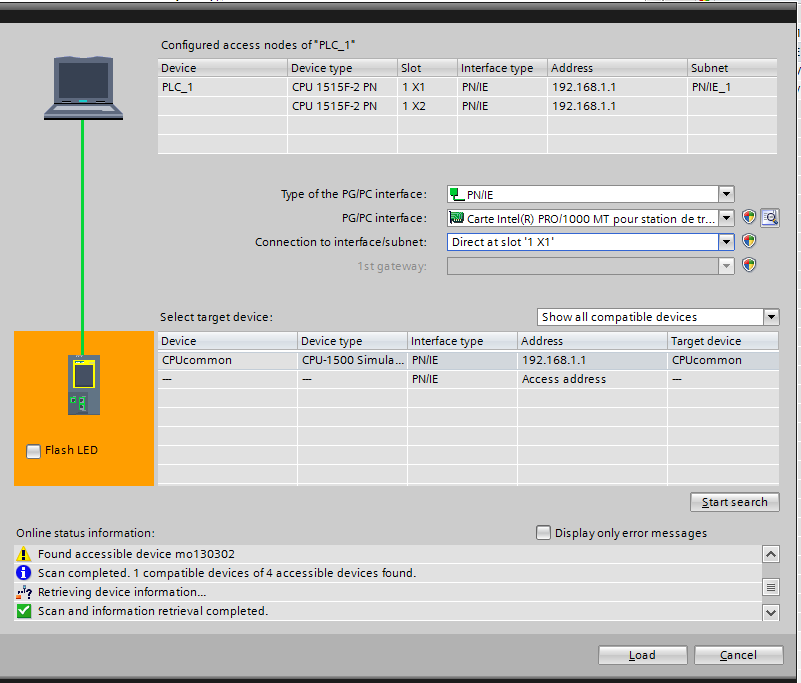

## Simulation

As soon as you’ll run the program, you should have an error on the feedback monitoring :

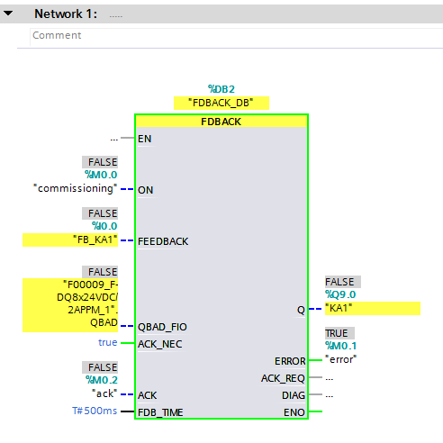

### Co-simulation

To solve this issue, we’ll running co-simulation with C#. The script will check the output value (%Q9.0) and set the feedback (%I0.0) accordingly. We’ll be using sharpdevelop as IDE.

#### Import DLL

Importing the DLL is easy :

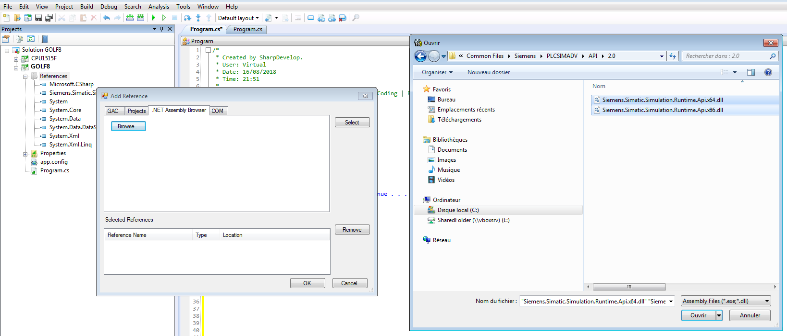

Then we write a short program :

```
/*
 * Created by SharpDevelop.
 */
using System;
using System.Threading;
using Siemens.Simatic.Simulation.Runtime;

namespace CPU1515F
{
	class Program
	{
		public static void Main(string[] args)
		{
			Console.WriteLine("Starting simulation");
			//Use it for local instance
			//IInstance myInstance = SimulationRuntimeManager.CreateInterface("Golf8");

			//Use it for remote instance
			IRemoteRuntimeManager myRemoteInstance = SimulationRuntimeManager.RemoteConnect("192.168.1.101:50000");
			IInstance myInstance = myRemoteInstance.CreateInterface("1515F");
		
			//Update tag list from API
			Console.WriteLine("Tags synchronization");
			myInstance.UpdateTagList();
		
			//Start a thread to synchronize feedbacks inputs 
			Thread tFeedbacks = new Thread(()=>synchroFeedbacks(myInstance));
			tFeedbacks.Start();
			
			//Allow the user to quit simulation
			Console.WriteLine("Simulation running");
			Console.WriteLine("Press any key to quit . . . ");
			Console.ReadKey(true);
		}
		
		static void synchroFeedbacks(IInstance myInstance)
        {
			while(true){
				//Keep %I and %Q opposite
				myInstance.WriteBool("FB_KA1", !myInstance.ReadBool("KA1"));	
			}
		}
	}
}
```

And run it :

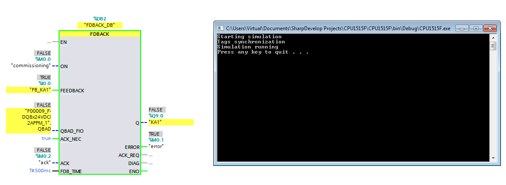

Once acknowledged, we should not have any issue.

Using the trace tool, we can confirm that it’s running perfectly fine, updating the input in around 100ms.

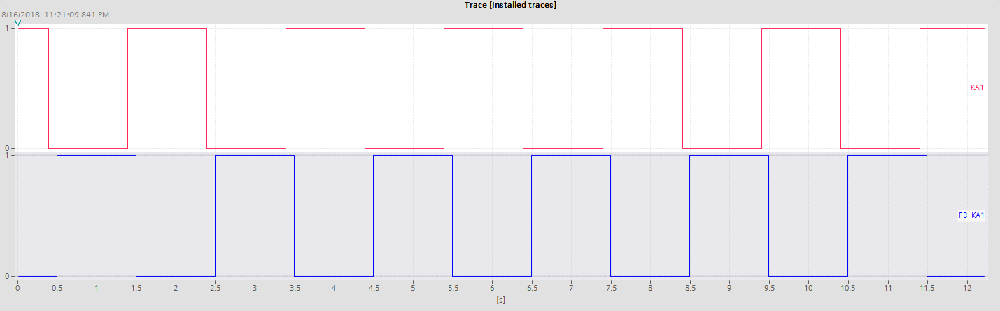

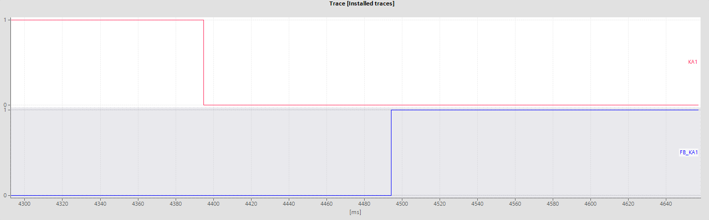

You're done with Siemens PLC simulation with virtual commissioning.  

