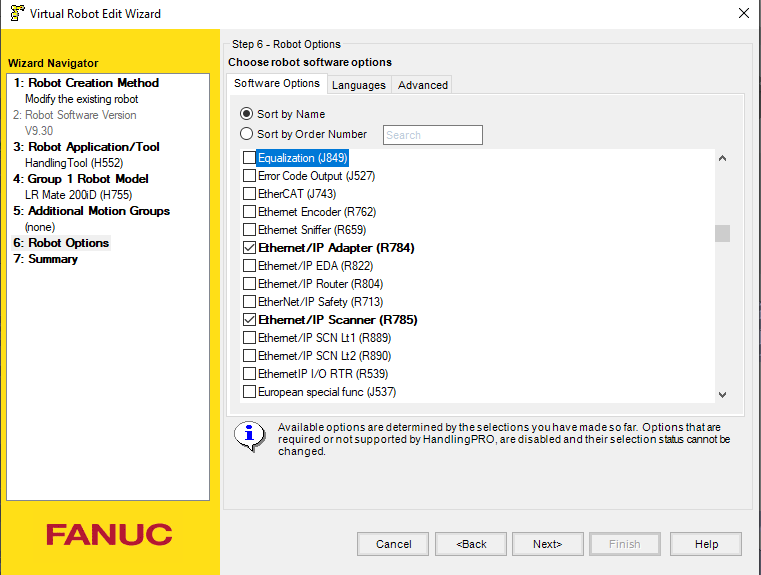
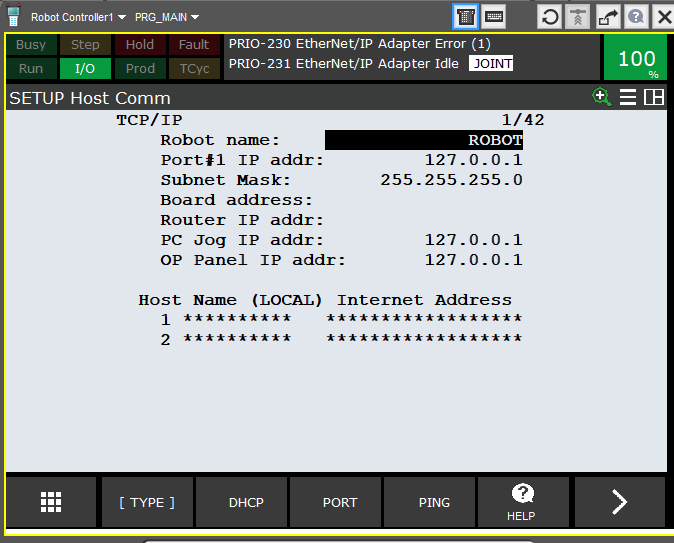
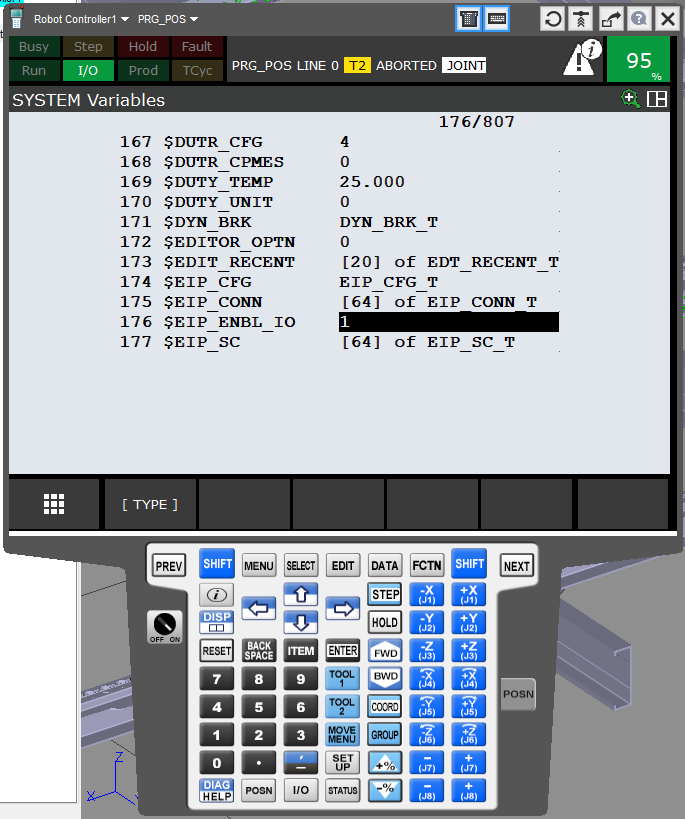

In order to be able to do EtherNet/IP simulation on [Fanuc Roboguide](https://www.fanuc.eu/be/fr/robots/accessoires/roboguide), we'll go through a few configuration steps.

## EtherNet/IP Introduction

Ethernet/IP (Ethernet Industrial Protocol) is an industrial communication protocol used in automation systems to connect devices such as programmable logic controllers (PLCs), sensors, actuators, and other industrial equipment. It is based on standard Ethernet and uses the TCP/IP and UDP/IP protocols for communication. It is a widely adopted protocol in industries like manufacturing, automotive, and energy.

Here are key details about Ethernet/IP:

### **Protocol Overview**

- **Standard**: Ethernet/IP is defined by the ODVA (Open DeviceNet Vendors Association) and is built on the IEEE 802.3 Ethernet standard.

- **Application Layer**: It uses the Common Industrial Protocol (CIP) for communication. CIP is the application layer that provides services for devices in industrial automation systems, such as devices connected to ControlNet, DeviceNet, and EtherNet/IP.

- **Communication Media**: Ethernet (100Base-TX, 1000Base-T, etc.), using standard Ethernet cables and hardware.

### **Key Communication Types**

- **Explicit Messaging**: Uses TCP/IP to send messages between devices for configuration, diagnostics, and data exchange.

- **Implicit Messaging (I/O Messaging)**: Uses UDP/IP for real-time data exchange (e.g., control signals, process data) between devices. This is typically used for high-performance applications where low latency is crucial.

### **Ethernet/IP Architecture**

- **Devices**: Ethernet/IP networks consist of various devices like PLCs, I/O modules, HMIs, drives, and sensors. These devices communicate with each other through Ethernet.

- **I/O Devices**: The most common devices in Ethernet/IP networks are I/O devices (e.g., sensors and actuators) that use implicit messaging to exchange process data.

- **Controller-to-Device Communication**: The PLC or controller exchanges data with the field devices via explicit or implicit messaging, depending on the requirements of the application.

## Robot creation in Roboguide

While doing the robot creation process, install the following options :  
\- R784 - Ethernet/IP Adapter  
\- R785 - Ethernet/IP Scanner

## Network configuration

Configure the network as shown below.

## Enable specific variable for Ethernet/IP simulation in Roboguide

You're done with EtherNet/IP simulation on Fanuc Roboguide !

