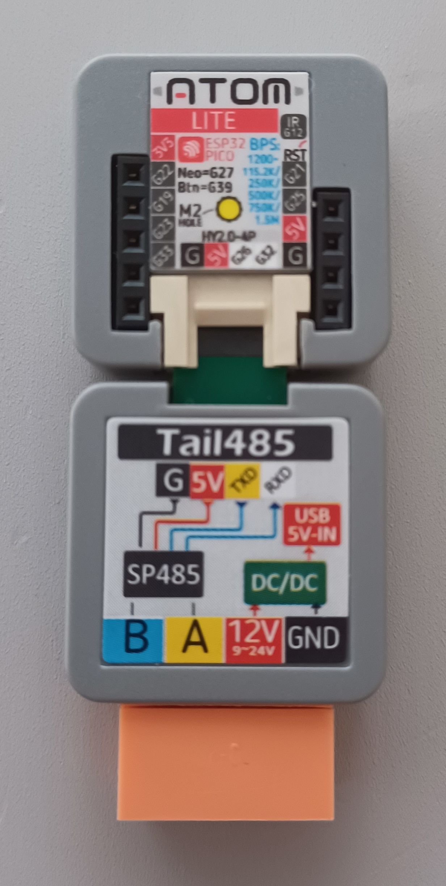
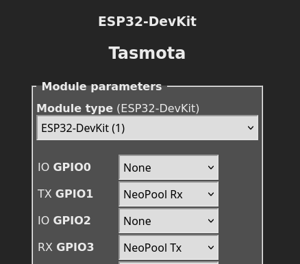
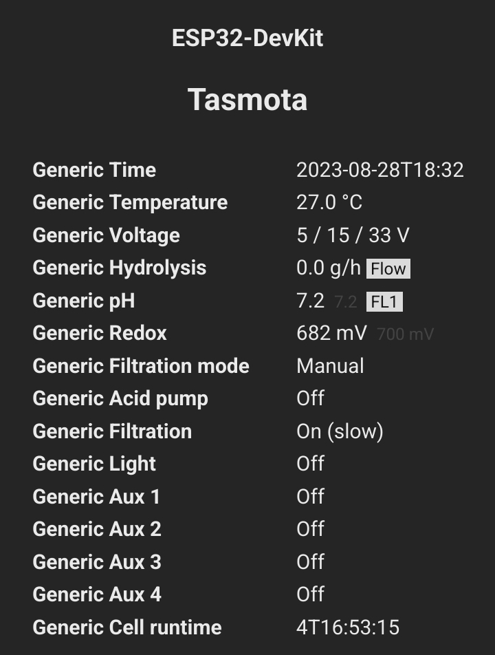

In order to get an Hayward Aquarite integration in Home Assistant with [Tasmota](https://tasmota.github.io/docs/) we'll go through several steps including wiring the ESP32 to the Aquarite and then the Home Assistant configuration.

## Hardware : ESP32

### Step 1 : Prototype

We'll use :  
\- ESP32 from AZ-Delivery  
\- RS485 to TTL adapter

The wiring will be done as follow :


### Step 2 : Final version

For the final version, we'll use an M5stack ESP32 with a RS485 tail, in order to have a clean, small and 10v powered device.



## Software : Tasmota

With the "Sugar Valley NeoPool module" Tasmota support natively this salt chlorinator.  
This option is not compile in the standard version, we'll need to compile Tasmota in order to compile this functionality.

### Tasmota compilation

Install Plateformio :

```bash
sudo apt-get install python-pip
sudo pip install -U platformio
```

Get Tasmota files :

```bash
git clone https://github.com/arendst/Tasmota.git
```

Before compiling, let's enable the support of the Sugar Valley NeoPool chlorinators :

```bash
vim tasmota/my_user_config.h 
```

And modify as follow :

```cpp
// !!! Remember that your changes GOES AT THE BOTTOM OF THIS FILE right before the last #endif !!!

#ifndef USE_NEOPOOL
#define USE_NEOPOOL
#endif

#endif // _USER_CONFIG_OVERRIDE_H_
```

Then compile and upload :

```bash
platformio run -e tasmota32 --target upload --upload-port /dev/ttyUSB0
```

### Tasmota configurtion

Configure IO as follow :



Then wire it, start it and you should be able to use data :



### Home assistant integration

Once done, you could process to MQTT integration and have a nice native integration in Home Assistant with Tasmota integration.

You're done with Hayward Aquarite integration in Home Assistant with Tasmota.

