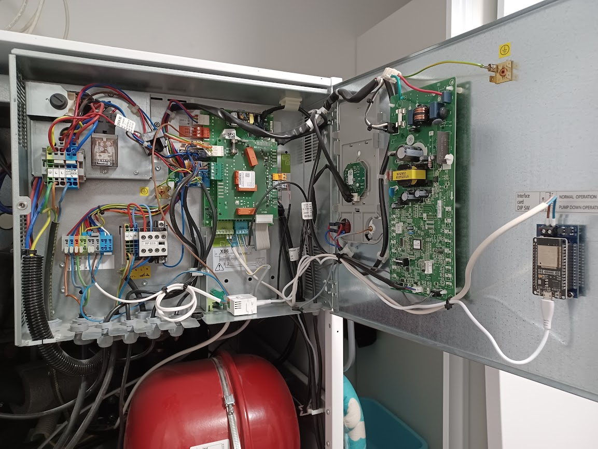
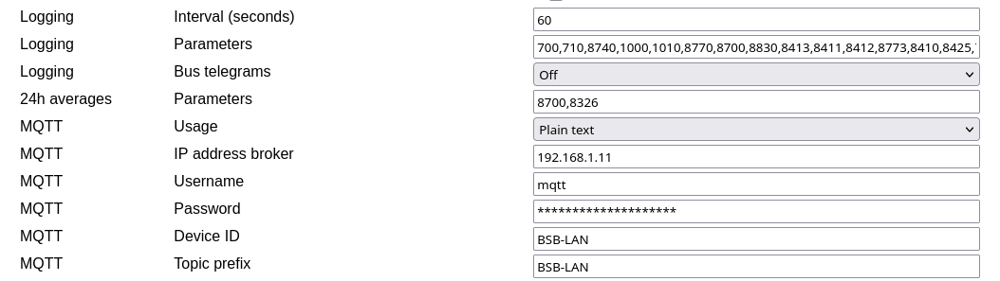
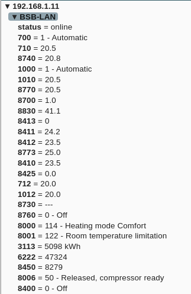
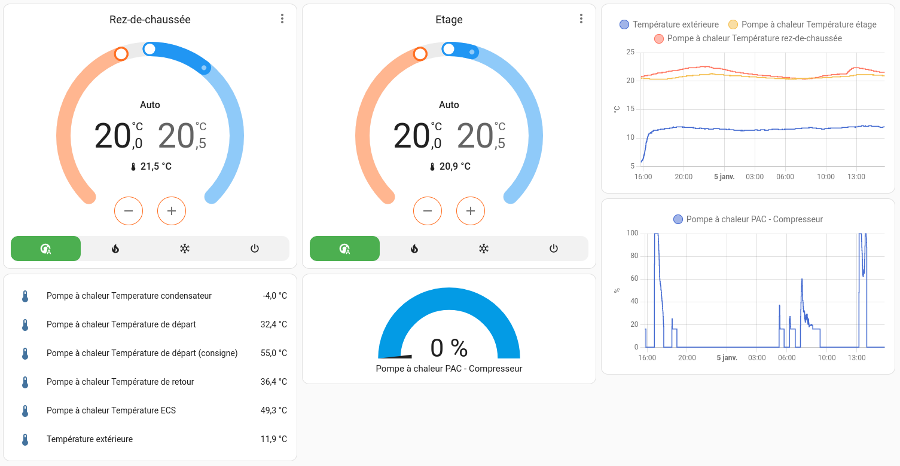

In order to get our Atlantic heat pump integration in home assistant, we'll need :  
\- BSB-LAN running on an ESP32  
\- MQTT broker up and running on Home Assistant  
\- Configure BSB-LAN to push data and Home assistant to diplay them.

Thanks to this configuration, you'll be able to monitor the heat pump data such as compressor activity and sensors. We will be able to control the heat pump using the climate control module of Home Assistant to adjust temperature setpoints.

## Hardware : Atlantic heat pump and ESP32.

The first step the hardware part using an ESP32 with a [BSB-LAN](https://github.com/fredlcore/BSB-LAN) hat.

You will see on the picture below :  
\- The ESP32 and the BSB-LAN hat mounted on the door  
\- The wiring on the X86 port of the Atlantic Alfea Extensa Duo heat pump  
\- A 230V to USB power supply



## Software : BSB-LAN and Home Assistant

### BSB LAN on ESP32

We'll use a BSB-LAN board with an ESP32. Following the [official documentation.](https://docs.bsb-lan.de/) I recommend to follow strictly the documentation in order to get it up and running.

One BSB-LAN up and running, we'll configure it to send data to Home Assistant MQTT broker.



### Home Assistant on the server

On the Home Assistant side, you should :  
\- Install the MQTT broker add-on  
\- Configure the MQTT broker  
\- Check the configuration using MQTT explorer.


Once the server is up and running, we can see that BSB-LAN is pushing data to the MQTT broker using MQTT explorer :



And then you can configure a nice dashboard such as the following one.



For this dashboard, here is my configuration :

**Configuration.yaml**

```yaml
mqtt: !include mqtt.yaml
```

**mqtt.yaml**

```yaml
climate: !include mqtt_climate.yaml
sensor: !include mqtt_sensor.yaml
number: !include mqtt_number.yaml
binary_sensor: !include mqtt_binary_sensor.yaml
```

**mqtt\_climate.yaml**

```yaml
- name: "Rez-de-chaussée"
  unique_id: bsb_lan_700
  payload_on: "1"
  payload_off: "0"
  modes:
    - auto
    - heat
    - cool
    - "off"
  mode_state_topic: "BSB-LAN/700"
  mode_state_template: >-
        
        {{ values[value] if value in values.keys() else 'off' }}
  mode_command_topic: "BSB-LAN"
  mode_command_template: >-
        
        {{ values[value] if value in values.keys() else '0' }}
  current_temperature_topic: "BSB-LAN/8740"
  min_temp: 17
  max_temp: 24
  temp_step: 0.5
  temperature_high_command_topic: "BSB-LAN"
  temperature_high_command_template: "{{'S710='+ (value | string)}}"
  temperature_high_state_topic: "BSB-LAN/710"
  temperature_low_command_topic: "BSB-LAN"
  temperature_low_command_template: "{{'S712='+ (value | string)}}"
  temperature_low_state_topic: "BSB-LAN/712"
  qos: 2
  
- name: "Etage"
  unique_id: bsb_lan_mode_719
  payload_on: "1"
  payload_off: "0"
  modes:
    - auto
    - heat
    - cool
    - "off"
  mode_state_topic: "BSB-LAN/1000"
  mode_state_template: >-
    
    {{ values[value] if value in values.keys() else 'off' }}
  mode_command_topic: "BSB-LAN"
  mode_command_template: >-
    
    {{ values[value] if value in values.keys() else '0' }}
  current_temperature_topic: "BSB-LAN/8770"
  min_temp: 17
  max_temp: 24
  temp_step: 0.5
  temperature_high_command_topic: "BSB-LAN"
  temperature_high_command_template: "{{'S1010='+ (value | string)}}"
  temperature_high_state_topic: "BSB-LAN/1010"
  temperature_low_command_topic: "BSB-LAN"
  temperature_low_command_template: "{{'S1012='+ (value | string)}}"
  temperature_low_state_topic: "BSB-LAN/1012"
  qos: 2
```

**mqtt\_sensor.yaml**

```yaml
- name: "Température extérieure"
  unique_id: bsb_lan_8700
  state_topic: "BSB-LAN/8700"
  unit_of_measurement: °C
  device_class: temperature
  state_class: measurement
  device:
    {
      identifiers: ["00000002"],
      name: "Pompe à chaleur",
      model: "ESP32",
      manufacturer: "BSB-LAN",
    }
- name: "Température rez-de-chaussée"
  unique_id: bsb_lan_8740
  state_topic: "BSB-LAN/8740"
  unit_of_measurement: °C
  device_class: temperature
  state_class: measurement
  device:
    {
      identifiers: ["00000002"],
      name: "Pompe à chaleur",
      model: "ESP32",
      manufacturer: "BSB-LAN",
    }
- name: "Température étage"
  unique_id: bsb_lan_8770
  state_topic: "BSB-LAN/8770"
  unit_of_measurement: °C
  device_class: temperature
  state_class: measurement
  device:
    {
      identifiers: ["00000002"],
      name: "Pompe à chaleur",
      model: "ESP32",
      manufacturer: "BSB-LAN",
    }
- name: "Température ECS"
  unique_id: bsb_lan_8830
  state_topic: "BSB-LAN/8830"
  unit_of_measurement: °C
  device_class: temperature
  state_class: measurement
  device:
    {
      identifiers: ["00000002"],
      name: "Pompe à chaleur",
      model: "ESP32",
      manufacturer: "BSB-LAN",
    }
- name: "PAC - Compresseur"
  unique_id: bsb_lan_8413
  state_topic: "BSB-LAN/8413"
  unit_of_measurement: "%"
  device_class: power_factor
  state_class: measurement
  device:
    {
      identifiers: ["00000002"],
      name: "Pompe à chaleur",
      model: "ESP32",
      manufacturer: "BSB-LAN",
    }
- name: "Température de départ (consigne)"
  unique_id: bsb_lan_8411
  state_topic: "BSB-LAN/8411"
  unit_of_measurement: °C
  device_class: temperature
  state_class: measurement
  device:
    {
      identifiers: ["00000002"],
      name: "Pompe à chaleur",
      model: "ESP32",
      manufacturer: "BSB-LAN",
    }
- name: "Température de départ"
  unique_id: bsb_lan_8412
  state_topic: "BSB-LAN/8412"
  unit_of_measurement: °C
  device_class: temperature
  state_class: measurement
  device:
    {
      identifiers: ["00000002"],
      name: "Pompe à chaleur",
      model: "ESP32",
      manufacturer: "BSB-LAN",
    }
- name: "Température de départ 2"
  unique_id: bsb_lan_8773
  state_topic: "BSB-LAN/8773"
  unit_of_measurement: °C
  device_class: temperature
  state_class: measurement
  device:
    {
      identifiers: ["00000002"],
      name: "Pompe à chaleur",
      model: "ESP32",
      manufacturer: "BSB-LAN",
    }
- name: "Température de retour"
  unique_id: bsb_lan_8410
  state_topic: "BSB-LAN/8410"
  unit_of_measurement: °C
  device_class: temperature
  state_class: measurement
  device:
    {
      identifiers: ["00000002"],
      name: "Pompe à chaleur",
      model: "ESP32",
      manufacturer: "BSB-LAN",
    }
- name: "Temperature condensateur"
  unique_id: bsb_lan_8425
  state_topic: "BSB-LAN/8425"
  unit_of_measurement: °C
  device_class: temperature
  state_class: measurement
  device:
    {
      identifiers: ["00000002"],
      name: "Pompe à chaleur",
      model: "ESP32",
      manufacturer: "BSB-LAN",
    }
- name: "Statut Rez-de-chaussée"
  state_topic: "BSB-LAN/8000"
  value_template: "{{value | regex_findall_index('- [ \t]+(.*)')}}"
  unique_id: bsb_lan_8000
  device:
    {
      identifiers: ["00000002"],
      name: "Pompe à chaleur",
      model: "ESP32",
      manufacturer: "BSB-LAN",
    }
- name: "Statut Etage"
  state_topic: "BSB-LAN/8001"
  value_template: "{{value | regex_findall_index('- [ \t]+(.*)')}}"
  unique_id: bsb_lan_8001
  device:
    {
      identifiers: ["00000002"],
      name: "Pompe à chaleur",
      model: "ESP32",
      manufacturer: "BSB-LAN",
    }
- name: "Statut ECS"
  state_topic: "BSB-LAN/8006"
  value_template: "{{value | regex_findall_index('- [ \t]+(.*)')}}"
  unique_id: bsb_lan_8006
  device:
    {
      identifiers: ["00000002"],
      name: "Pompe à chaleur",
      model: "ESP32",
      manufacturer: "BSB-LAN",
    }
- name: "Consommation"
  state_topic: "BSB-LAN/3113"
  unique_id: bsb_lan_3113
  unit_of_measurement: "kWh"
  device_class: energy
  state_class: total
  value_template: "{{ value[:-4] }}"
  device:
    {
      identifiers: ["00000002"],
      name: "Pompe à chaleur",
      model: "ESP32",
      manufacturer: "BSB-LAN",
    }
```

**mqtt\_number.yaml**

```yaml
- name: Température confort rez-de-chaussée
  unique_id: bsb_lan_710
  state_topic: "BSB-LAN/710"
  command_topic: "BSB-LAN"
  command_template: "S710={{ value }}"
  mode: slider
  min: 12
  max: 26
  step: 0.1
  unit_of_measurement: °C
  device_class: temperature
  icon: mdi:temperature-celsius
  device:
    {
      identifiers: ["00000002"],
      name: "Pompe à chaleur",
      model: "ESP32",
      manufacturer: "BSB-LAN",
    }
- name: Température réduite rez-de-chaussée
  unique_id: bsb_lan_712
  state_topic: "BSB-LAN/712"
  command_topic: "BSB-LAN"
  command_template: "S712={{ value }}"
  mode: slider
  min: 12
  max: 26
  step: 0.1
  unit_of_measurement: °C
  device_class: temperature
  icon: mdi:temperature-celsius
  device:
    {
      identifiers: ["00000002"],
      name: "Pompe à chaleur",
      model: "ESP32",
      manufacturer: "BSB-LAN",
    }
- name: Température confort étage
  unique_id: bsb_lan_1010
  state_topic: "BSB-LAN/1010"
  command_topic: "BSB-LAN"
  command_template: "S1010={{ value }}"
  mode: slider
  min: 12
  max: 26
  step: 0.1
  unit_of_measurement: °C
  device_class: temperature
  icon: mdi:temperature-celsius
  device:
    {
      identifiers: ["00000002"],
      name: "Pompe à chaleur",
      model: "ESP32",
      manufacturer: "BSB-LAN",
    }
- name: Température réduite étage
  unique_id: bsb_lan_1012
  state_topic: "BSB-LAN/1012"
  command_topic: "BSB-LAN"
  command_template: "S1012={{ value }}"
  mode: slider
  min: 12
  max: 26
  step: 0.1
  unit_of_measurement: °C
  device_class: temperature
  icon: mdi:temperature-celsius
  device:
    {
      identifiers: ["00000002"],
      name: "Pompe à chaleur",
      model: "ESP32",
      manufacturer: "BSB-LAN",
    }
```

**mqtt\_binary\_sensor.yaml**

```yaml
- name: Pompe circuit 1
  unique_id: bsb_lan_8730
  state_topic: "BSB-LAN/8730"
  payload_on: "1 - On"
  payload_off: "0 - Off"
  device:
    {
      identifiers: ["00000002"],
      name: "Pompe à chaleur",
      model: "ESP32",
      manufacturer: "BSB-LAN",
    }
- name: Pompe circuit 2
  unique_id: bsb_lan_8760
  state_topic: "BSB-LAN/8760"
  payload_on: "1 - On"
  payload_off: "0 - Off"
  device:
    {
      identifiers: ["00000002"],
      name: "Pompe à chaleur",
      model: "ESP32",
      manufacturer: "BSB-LAN",
    }
```

You're done : Atlantic heat pump integration in home assistant with BSB-LAN.

