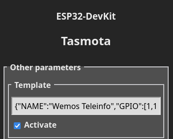
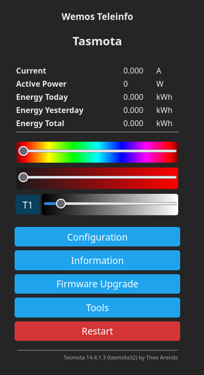
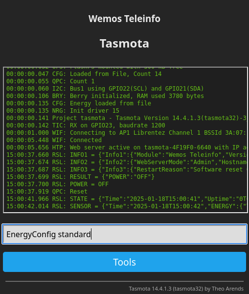
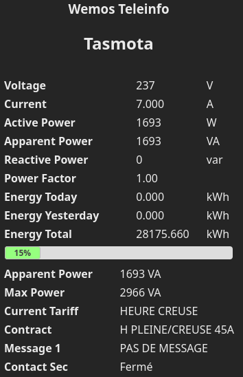
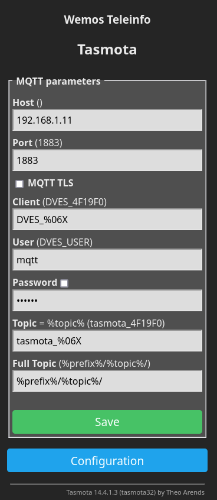
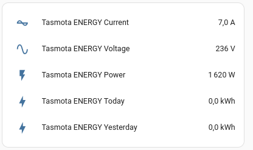
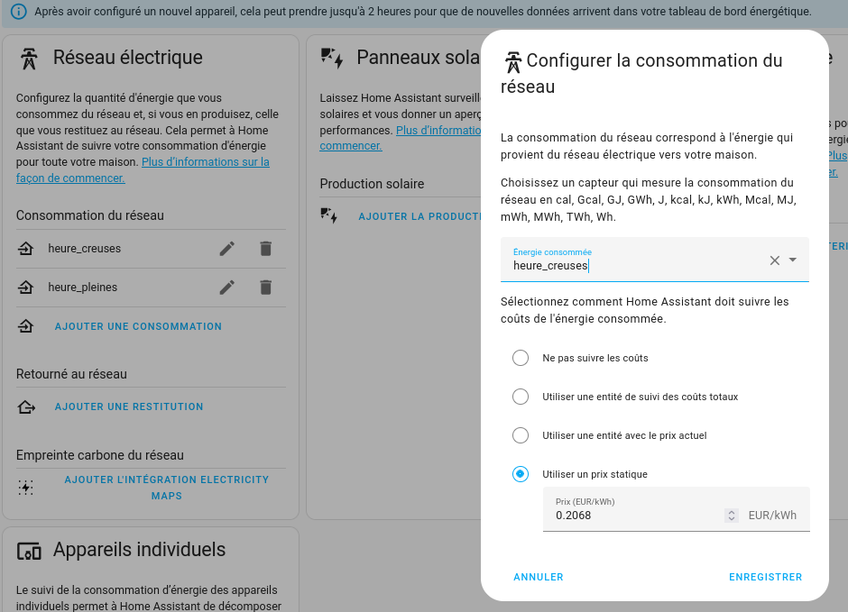
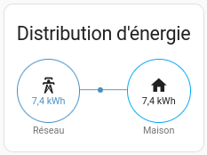
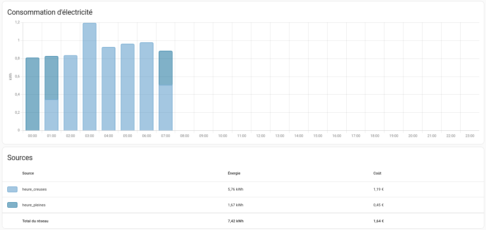

Linky integration in standard mode with Home Assistant and Tasmota.

In this post, we'll go through the steps to get energy data from a Linky in standard mode right into Home Assistant through MQTT using Tasmota running on a ESP32 with a [Wemos Teleinfo Hat](https://www.tindie.com/products/hallard/wemos-teleinfo/).


## 1 - Tasmota (Linky side)

On the linky side, the hardware will be :  
\- [Module WiFi Mini NodeMCU ESP32 D1](https://www.az-delivery.de/fr/products/esp32-d1-mini)  
\- [WeMos Teleinfo ESP8266/ESP32/S2/C3/S3 Shield](https://www.tindie.com/products/hallard/wemos-teleinfo/)

Get Tasmota files :

```bash
git clone https://github.com/arendst/Tasmota.git
```

Go to the Tasmota folder

```bash
cd Tasmota
```

Before compiling, let’s enable the support of Teleinfo

```bash
vim tasmota/my_user_config.h
```

And uncomment the following line

```cpp
#define USE_TELEINFO // Add support for Teleinfo via serial RX interface (+5k2 code, +168 RAM + SmartMeter LinkedList Values RAM)
```

Create a venv environment and source it :

```bash
python3 -m venv ./venv
source venv/bin/activate
```

Install plateformio

```bash
pip install platformio
```

Then compile and upload :

```bash
platformio run -e tasmota32 --target upload --upload-port /dev/ttyUSB0
```

Then finish the Tasmota configuration as usual :

- Connect to the Tasmota Wifi
- Go to the 192.168.4.1 IP address
- Setup your Wifi

Then go to **Configuration -> Other** and set as template the following parameters (**don't forget to tick "Activate"**)

```json
{"NAME":"Wemos Teleinfo","GPIO":[1,1,1,1,1,1,1,1,1,1,1,1,1,1,1376,1,1,640,608,5632,1,1,0,1,0,0,0,1,1,1,1,1,1,1,1,1],"FLAG":0,"BASE":1}
```



Then the ESP32 will reboot and you should have something like the screenshot below



Finally, let's configure the Linky mode to standard



You should have the following feedback

```plaintext
15:02:17.014 CMD: EnergyConfig standard
15:02:17.017 TIC: 'standard' mode
15:02:17.017 TIC: RX on GPIO23, baudrate 9600
15:02:17.019 RSL: RESULT = {"EnergyConfig":"Done"}
```



Then I configure the MQTT parameters to push data to the MQTT broker



## 2 - Home Assistant

### 2.1 - Simple sensors

Integration in Home Assistant is easy.

Here is an example :

```yaml
type: entities
entities:
  - entity: sensor.tasmota_energy_current
  - entity: sensor.tasmota_energy_voltage
  - entity: sensor.tasmota_energy_power
  - entity: sensor.tasmota_energy_today
  - entity: sensor.tasmota_energy_yesterday
```

With the following result :



### 2.2 - Energy dashboard

In order to be able to track cost, we'll create a template doing a copy of indexes and register them with the right properties (device\_class, unit..).

In our configuration we'll have :

```yaml
template: !include template.yaml
```

And in template.yaml we'll have :

```yaml
sensor:
  - name: "heure_creuses"
    state: "{{ states('sensor.tasmota_tic_easf01') }}"
    unit_of_measurement: kWh
    device_class: energy
    state_class: total_increasing
  - name: "heure_pleines"
    state: "{{ states('sensor.tasmota_tic_easf02') }}"
    unit_of_measurement: kWh
    device_class: energy
    state_class: total_increasing
```

Then you should be able to parameter the energy inputs as follow :



Then you'll have data displayed.





You're done : Linky integration in standard mode with Home Assistant and Tasmota.

