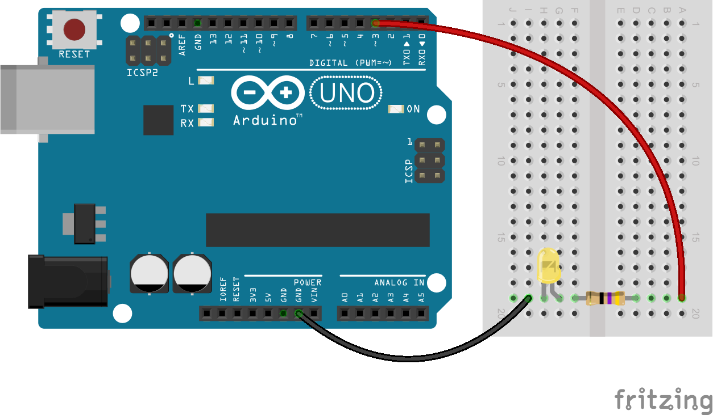
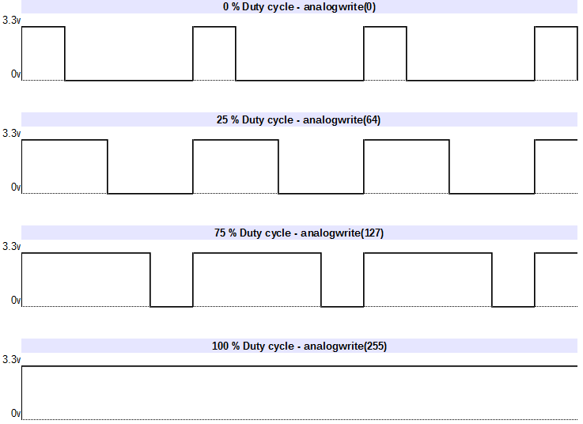
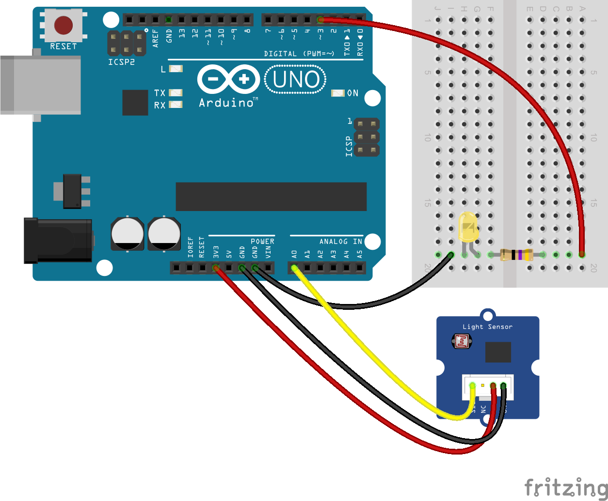
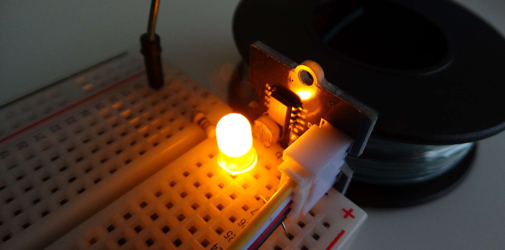
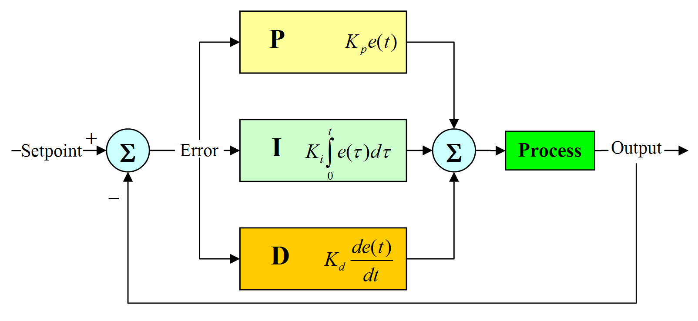
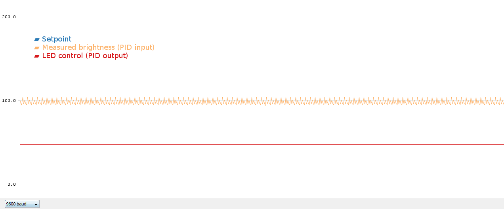
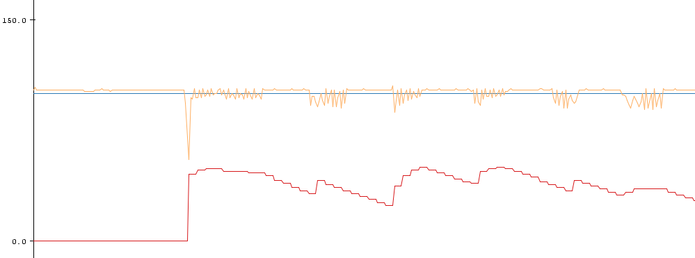
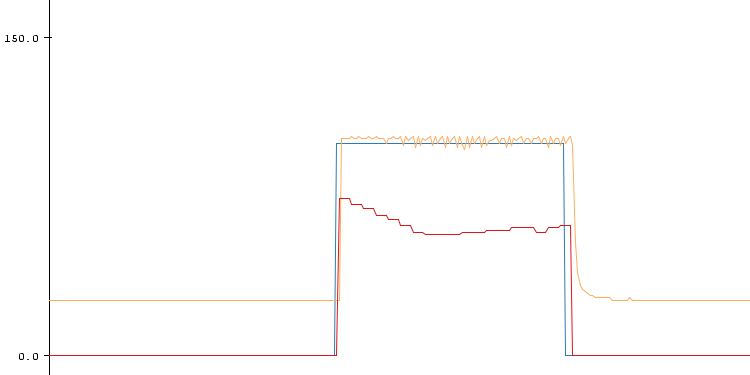

[PID regulation](https://docs.arduino.cc/libraries/pid/) : Led brightness regulation with Arduino. To get this done we'll first do a bit of wiring and then program our Arduino.

## Led wiring and control

### Wiring

Our led is a Yellow led with a 2.4v forward voltage at 20mA.  
Our current source (Arduino) delivers 3.3v.  
Resistor calculation : R = (3.3v - 2.4 V) / 25 mA = 0.9v / 0.02A = 45Ω

We’ll wire the cathode to one of the digital I/O of the Arduino. Note, we chose the digital I/O #3 as we’ll need to use PWM (described below).

As I just had a 47Ω resistor, this will work :



### Control

In order to control the brightness of the LED, we’ll use the Pulse-width modulation (PWM), or pulse-duration modulation (PDM) :



To do this, we’ll use the following function : analogWrite(pin, value)  
\- pin: the pin to write to.  
\- value: the duty cycle: between 0 (always off) and 255 (always on)

Code sample :

```
void setup()
{
pinMode(3, OUTPUT); 
}

void loop()
{
//Analog write
analogWrite(3, 64); 
}
```

Results (0, 25%, 75%, 100%) :


## Led brightness regulation

#### Sensor

We’ll add a light sensor as wired below :



Just place the sensor in front of the LED:



### Regulation

In order to regulate, we’ll use a proportional–integral–derivative controller. A PID controller is a control loop feedback mechanism (controller) commonly used in industrial control systems. A PID controller continuously calculates an error value as the difference between a desired setpoint and a measured process variable. The controller attempts to minimize the error over time by adjustment of a control variable.



Here is the code :

```
#include <PID_v1.h>
//Variables
double Setpoint, Input, Output;
//PID parameters
double Kp=0, Ki=10, Kd=0;

//Start PID instance
PID myPID(&Input, &Output, &Setpoint, Kp, Ki, Kd, DIRECT);

void setup()
{
  //Start a serial connection to send data by serial connection
  Serial.begin(9600);   
  //Set point : Here is the brightness target
  Setpoint = 100;
  //Turn the PID on
  myPID.SetMode(AUTOMATIC);
  //Adjust PID values
  myPID.SetTunings(Kp, Ki, Kd);
}

void loop()
{
  //Read the value from the light sensor. Analog input : 0 to 1024. We map is to a value from 0 to 255 as it's used for our PWM function.
  Input = map(analogRead(0), 0, 1024, 0, 255); 
  //PID calculation
  myPID.Compute();
  //Write the output as calculated by the PID function
  analogWrite(3,Output);
  //Send data by serial for plotting 
  Serial.print(Input);
  Serial.print(" ");
  Serial.println(Output);   
}
```

PID Parameters :

- Kp accounts for present values of the error (e.g. if the error is large and positive, the control variable will be large and negative).

- Ki accounts for past values of the error (e.g. if the output is not sufficient to reduce the size of the error, the control variable will accumulate over time, causing the controller to apply a stronger action).

- Kd accounts for possible future values of the error, based on its current rate of change.

The Arduino 1.6.6 comes with a tool called “Serial plotter”, that might be useful to graph our data:



The measured value is note stable, probably due to the PWM. A solution would be to smooth the results by doing an average on the lasts results, in order to filter the high frequency changes.

Note : You can graph several values at the same time, you just need to send them on the same line, with a space as a delimiter.

When I disrupt the system with an external light, we clearly see that the system tries to keep the brightness at the setpoint (100) by managing the led control value :



To conclude, here is how the system is handling a change from 0 to setpoint, or from setpoint to 0 :



You're done with PID regulation : Led brightness regulation with Arduino

