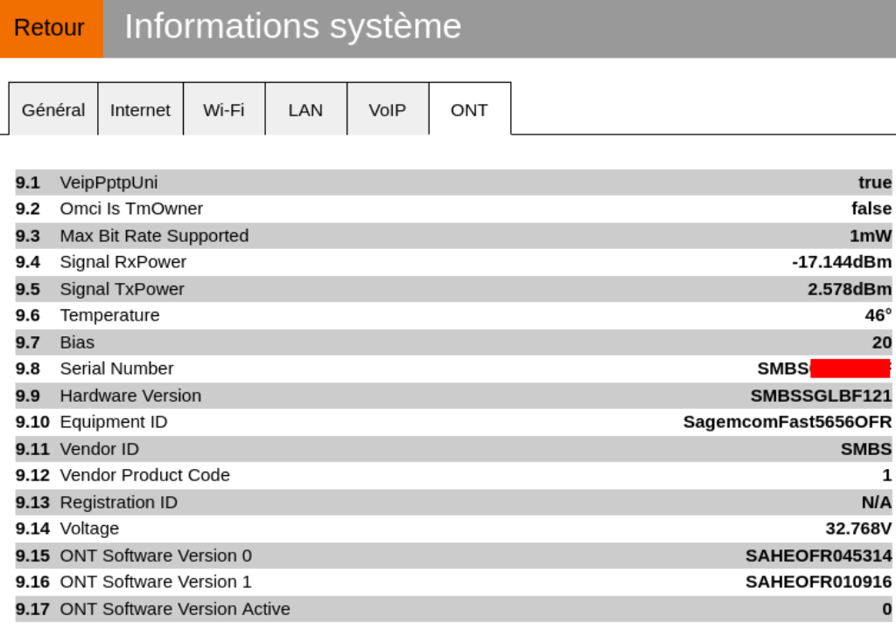

In order to Replace Livebox with a MikroTik RB750Gr3 router and [XT-010H-D ONT](https://www.leolabs.pl/ont-leox-lxt-010h-d.html), we'll need to configure the ONT first, and then the Mikrotik.

An ONT (Optical Network Terminal) is a crucial device in fiber-optic communication systems. It serves as the interface between the fiber-optic network and end-user equipment, converting optical signals into electrical signals for devices like computers, phones, and TVs. Typically installed at the customer’s premises, the ONT connects to a fiber-optic cable and enables high-speed internet, phone, and TV services. It provides functions like signal conversion, data routing, and often features multiple Ethernet ports and sometimes Wi-Fi capabilities. The ONT ensures efficient data transmission by managing fiber signals, optimizing performance, and supporting reliable connectivity for residential or business users.

## ONT : Configure the Leox XT-010H-D

First, let’s get the livebox ONT serial number, to be able to use the same for out Leox XT-010H-D



Then, you should be able to connect to the Leox XT-010H-D with the following parameters :

- IP : 192.168.100.1

- Protocol : Telnet

- Login leox

- Password leolabs\_7

Then we adjust the required parameters :

```
telnet 192.168.100.1
Trying 192.168.100.1...
Connected to 192.168.100.1.
Escape character is '^]'.
LXT-010H-D login: leox
Password: 
# flash set GPON_SN SMBSXXXXXXXX
GPON_SN=SMBSXXXXXXXX
# flash set PON_VENDOR_ID SMBS
PON_VENDOR_ID=SMBS
telnet 192.168.100.1
Trying 192.168.100.1...
Connected to 192.168.100.1.
Escape character is '^]'.
LXT-010H-D login: leox
Password: 
# flash set GPON_SN SMBSXXXXXXXX
GPON_SN=SMBSXXXXXXXX
# flash set PON_VENDOR_ID SMBS
PON_VENDOR_ID=SMBS
```

## Router : Configure the Mikroktik RB750Gr3 to replace the Livebox

Notes :

- Port 1 : ONT

- Port 2 - 5 : Home network

Interfaces :

```
/interface bridge
add name=FTTH
add name=bridge

/interface vlan
add interface=ether1 name=VLAN832 vlan-id=832

/interface list
add comment=defconf name=WAN
add comment=defconf name=LAN

/interface wireless security-profiles
set [ find default=yes ] supplicant-identity=MikroTik
```

Authentication : Replace xxxxxxx by the login fti/xxxxxxx in hexadecimal.

```
/ip dhcp-client option
add code=77 name=userclass value=0x2b46535644534c5f6c697665626f782e496e7465726e65742e736f66746174686f6d652e4c697665626f7834
add code=90 name=authsend value=0x00000000000000000000000x00000000000000000000006674692fxxxxxxxxxxxxxx
```

To finish the configuration :

```
/ip pool
add name=default-dhcp ranges=192.168.1.10-192.168.1.254

/ip dhcp-server
add address-pool=default-dhcp disabled=no interface=bridge name=defconf

/interface bridge filter
add action=set-priority chain=output dst-port=67 ip-protocol=udp mac-protocol=ip new-priority=6 out-interface=VLAN832 passthrough=yes src-port=68

/interface bridge port
add bridge=bridge comment=defconf interface=ether2
add bridge=bridge comment=defconf interface=ether3
add bridge=bridge comment=defconf interface=ether4
add bridge=bridge comment=defconf interface=ether5
add bridge=FTTH interface=VLAN832

/ip neighbor discovery-settings
set discover-interface-list=LAN

/interface list member
add comment=defconf interface=bridge list=LAN
add comment=defconf interface=FTTH list=WAN

/ip address
add address=192.168.1.1/24 comment=defconf interface=bridge network=192.168.1.0

/ip dhcp-client
add dhcp-options=authsend,clientid,hostname,userclass disabled=no interface=FTTH

/ip

/ip dns
set allow-remote-requests=yes servers=1.1.1.1,1.0.0.1

/ip dns static
add address=172.6.0.254 comment=defconf name=router.lan

/ip firewall filter
add action=accept chain=input comment="defconf: accept established,related,untracked" connection-state=established,related,untracked
add action=drop chain=input comment="defconf: drop invalid" connection-state=invalid
add action=accept chain=input comment="defconf: accept ICMP" protocol=icmp
add action=accept chain=input comment="defconf: accept to local loopback (for CAPsMAN)" dst-address=127.0.0.1
add action=drop chain=input comment="defconf: drop all not coming from LAN" in-interface-list=!LAN
add action=accept chain=forward comment="defconf: accept in ipsec policy" ipsec-policy=in,ipsec
add action=accept chain=forward comment="defconf: accept out ipsec policy" ipsec-policy=out,ipsec
add action=fasttrack-connection chain=forward comment="defconf: fasttrack" connection-state=established,related
add action=accept chain=forward comment="defconf: accept established,related, untracked" connection-state=established,related,untracked
add action=drop chain=forward comment="defconf: drop invalid" connection-state=invalid
add action=drop chain=forward comment="defconf: drop all from WAN not DSTNATed" connection-nat-state=!dstnat connection-state=new in-interface-list=WAN

/ip firewall nat
add action=masquerade chain=srcnat comment="defconf: masquerade" ipsec-policy=out,none out-interface-list=WAN

/ip service
set telnet disabled=yes
set ftp disabled=yes
set ssh disabled=yes 

/system clock
set time-zone-name=Europe/Paris

/tool mac-server
set allowed-interface-list=LAN

/tool mac-server mac-winbox
set allowed-interface-list=LAN
```

You're done : Replace Livebox with a MikroTik RB750Gr3 router and XT-010H-D ONT

