In this article, we will go through the process of unrelated parallel machine scheduling optimization with a genetic algorithm.

## Introduction

For the Scheduling on Unrelated Parallel Machines proble the goal is to find an jobs/machines assignment to minimize the overall makespan, so the goal is to have the best balance between machines.

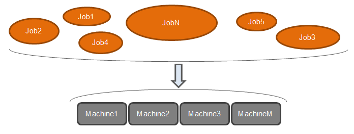

<figure>

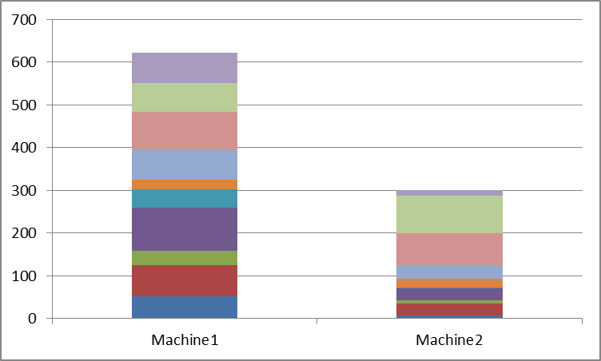

<figcaption>

Not well balanced schedule

</figcaption>

</figure>

<figure>

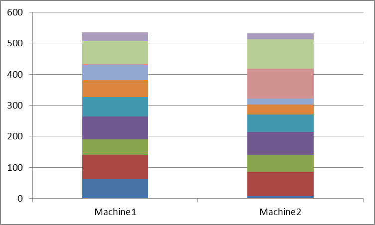

<figcaption>

Well balanced schedule

</figcaption>

</figure>

## Problem data

For our problem, we will consider n jobs to be assigned on m machines.

### Processing time

First, the jobs processing time will be manage as follow :

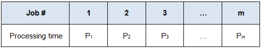

### Job assignment

We will manage the jobs/machines assignment as follow : If the job j is schedule on machine i then Xij = 1, else Xij = 0.

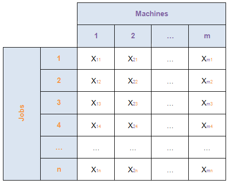

## Genetic algorithms

### Introduction

A **genetic algorithm** (GA) is a search heuristic that is used to solve optimization and search problems. It is inspired by the process of natural selection and the principles of genetics. The algorithm simulates the process of evolution, where the fittest individuals are selected for reproduction to produce the offspring of the next generation.

Here's how it works in general:

1. **Initial Population**: The algorithm starts with a randomly generated population of possible solutions (individuals), often represented as strings of binary values, real numbers, or other data structures.

3. **Selection**: Individuals are selected based on their fitness, which is usually evaluated using a fitness function. The more suitable or "fit" an individual is for solving the problem, the higher its chance of being selected for reproduction.

5. **Crossover (Recombination)**: Selected individuals are paired, and their genetic information is combined (crossover) to produce offspring. This mimics the natural genetic recombination that occurs during reproduction.

7. **Mutation**: After crossover, some offspring undergo mutation, where random changes are made to their genetic structure. This introduces variability and helps explore new solutions.

9. **Evaluation and Replacement**: The new generation of solutions is evaluated, and the least fit individuals are replaced by the new, more fit offspring.

11. **Termination**: The process repeats for several generations or until a termination criterion is met, such as finding a solution with sufficient fitness, a set number of generations, or convergence of the population.

Genetic algorithms are versatile and can be applied to various problems, including optimization, machine learning, scheduling, and engineering design. They are particularly useful for problems where the solution space is large, complex, and not easily navigable by traditional methods.

<figure>

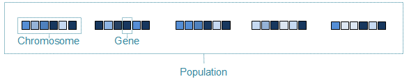

<figcaption>

Genetic algorithm data structure

</figcaption>

</figure>

<figure>

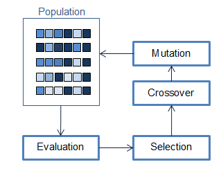

<figcaption>

Genetic algorithm process

</figcaption>

</figure>

To find better solutions, the process is:  
1- Evaluation: Sort the population based on chromosomes scores (fitness).  
2- Selection: Choose the best chromosomes to generate the next population (natural selection).  
3- Crossover: Mate the chromosomes between them by mixing their genome.  
4- Mutation: As in a natural environment, some genes are changed arbitrarily.

### Example

The goal is to give a practical idea of the genetic algorithm operations. We’ll consider a problem with 2 machines (m=2) and 4 jobs (n=4).

#### Processing times

<figure>

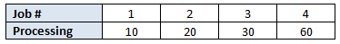

<figcaption>

Example for processing times

</figcaption>

</figure>

#### Population

Let’s generate 4 chromosomes randomly :

<figure>

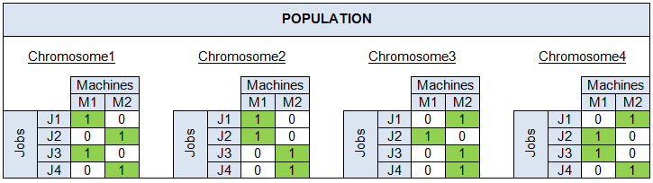

<figcaption>

Example for population

</figcaption>

</figure>

#### Evaluation

Evaluation of the generated chromosomes :

<figure>

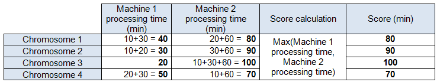

<figcaption>

Example for evaluation

</figcaption>

</figure>

#### Selection

Select only the bests chromosomes, here we’ll choose to keep 75% of the sorted population :

<figure>

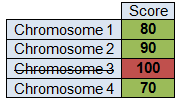

<figcaption>

Example for selection

</figcaption>

</figure>

#### Crossover

1 – Choose two random chromosomes in the selected ones (the best ones).  
2 – Merge these two chromosomes by mixing their genome.  
3 – Store the new generated chromosome in the new population.  
4 – Repeat the crossover operation until the new population is fully generated.

<figure>

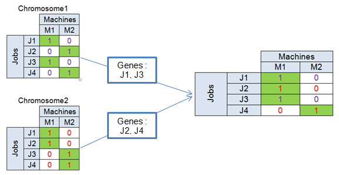

<figcaption>

Example for crossover

</figcaption>

</figure>

#### Mutation

The mutation operation is not systematic. Usually, around 1% of the crossover chromosomes will go through a mutation. During this operation, we will randomly change a gene :

<figure>

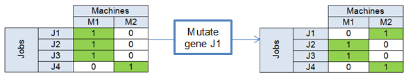

<figcaption>

Example for mutation

</figcaption>

</figure>

## Code example

Here is a [Python](https://www.python.org/) implementation.

```
 __author__ = 'rfontenay'
 __description__ = 'Genetic algorithm to solve a scheduling problem of N jobs on M parallel machines'
 import random
 import time
# ******************* Parameters ******************* #
# Jobs processing times
jobsProcessingTime = [543, 545, 854, 766, 599, 657, 556, 568, 242, 371, 5, 569, 9, 614, 464, 557, 460, 970, 772, 886,
69, 423, 181, 98, 25, 642, 222, 842, 328, 799, 651, 197, 213, 666, 112, 136, 150, 810, 37, 620,
139, 721, 823, 351, 953, 765, 204, 800, 840, 132, 764, 336, 587, 514, 948, 134, 203, 766, 954,
537, 933, 458, 936, 835, 335, 690, 307, 102, 639, 635, 923, 699, 71, 913, 465, 664, 49, 198, 747,
931, 124, 41, 214, 246, 954, 676, 811, 295, 977, 100, 316, 453, 903, 50, 120, 320, 517, 441, 874,
842]
# Number of jobs
n = len(jobsProcessingTime)
# Number of machines
m = 2
# Genetic Algorithm : Population size
GA_POPSIZE = 256
# Genetic Algorithm : Elite rate
GA_ELITRATE = 0.1
# Genetic Algorithm : Mutation rate
GA_MUTATIONRATE = 0.25
# Genetic Algorithm : Iterations number
GA_ITERATIONS = 1000
# ******************* Functions ******************* #
def random_chromosome():
"""
Description :Generate a chromosome with a random genome (for each job, assign a random machine).
Input : -Line 2 of comment...
Output : Random chromosome.
"""
# Jobs assignment : Boolean matrix with 1 line by job, 1 column by machine
new_chromosome = [[0 for i in range(m)] for j in range(n)]
# For each job, assign a random machine
for i in range(n):
new_chromosome[i][random.randint(0, m - 1)] = 1
return new_chromosome
def fitness(chromosome):
"""
Description : Calculate the score of the specified chromosome.
The score is the longest processing time among all the machines processing times.
Input : A chromosome.
Output : The score/fitness.
"""
max_processing_time = -1
for i in range(m):
machine_processing_time = 0
for j in range(n):
machine_processing_time += chromosome[j][i] * jobsProcessingTime[j]
# Save the maximum processing time found
if machine_processing_time > max_processing_time:
max_processing_time = machine_processing_time
return max_processing_time
def crossover(chromosome1, chromosome2):
"""
Description : Crossover two chromosomes by alternative genes picking.
Input : Two chromosome.
Output : One chromosome.
"""
new_chromosome = [[0 for i in range(m)] for j in range(n)]
for i in range(n):
# Alternate the pickup between the two selected solutions
if not i % 2:
new_chromosome[i] = chromosome1[i]
else:
new_chromosome[i] = chromosome2[i]
return new_chromosome
def evolve(population):
"""
Description : Create a new population based on the previous population.
The new population is generated by mixing the best chromosomes of the previous population.
Input : Old population.
Output : New population.
"""
new_population = [[] for i in range(GA_POPSIZE)]
# First : Keep elites untouched
elites_size = int(GA_POPSIZE * GA_ELITRATE)
for i in xrange(elites_size): # Elitism
new_population[i] = population[i]
# Then generate the new population
for i in range(elites_size, GA_POPSIZE):
# Generate new chromosome by crossing over two from the previous population
new_population[i] = crossover(population[random.randint(0, GA_POPSIZE / 2)],
population[random.randint(0, GA_POPSIZE / 2)])
# Mutate
if random.random() < GA_MUTATIONRATE:
random_job = random.randint(0, n - 1)
# Reset assignment
new_population[i][random_job] = [0 for j in range(m)]
# Random re-assignment
new_population[i][random_job][random.randint(0, m - 1)] = 1
return new_population

# ******************* Program ******************* #
# Measure execution time
start = time.time()

# Generate an initial random population
population = [[] for i in range(GA_POPSIZE)]
for i in range(GA_POPSIZE):
population[i] = random_chromosome()

# Sort the population based on the fitness of chromosomes
population = sorted(population, key=lambda c: fitness(c))
# Print initial best makespan
print “Starting makespan = %03d” % (fitness(population[0]))
#Iterate
for i in range(GA_ITERATIONS):
# Sort the population : order by chromosone’s scores.
population = sorted(population, key=lambda c: fitness(c))
#Generate the following generation (new population)
population = evolve(population)

# Print the best fitness and the execution time after iterations
print "Ending makespan = %03d" % (fitness(population[0]))
print "Execution time = %02d s" % (time.time() - start)
```

You're done with Unrelated parallel machine scheduling optimization with a genetic algorithm

